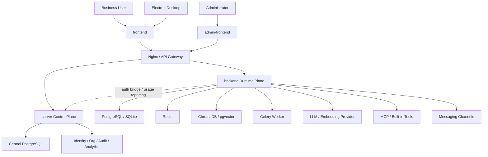

# Zhishu RAG Intelligent Knowledge Platform

Zhishu is an open-source RAG platform for enterprise knowledge management, intelligent question answering, and knowledge service publishing. It combines document ingestion, database synchronization, hybrid retrieval, LLM orchestration, agents, tools, workspaces, channel integrations, and deployment tooling in one repository.

## Highlights

- Multi-format document parsing for PDF, Word, Excel, PPT, Markdown, HTML, TXT, and images.
- Hybrid retrieval with dense vectors and BM25.
- Streaming chat, multi-turn context, query rewriting, reranking, and NL2SQL.
- Multi-agent collaboration across knowledge bases.
- MCP and built-in tool integration.
- Workspace collaboration, app publishing, API sharing, and channel integrations.
- Separate runtime plane and control plane for local, desktop, and cloud deployments.

## Architecture



### Runtime and Control Planes

| Module | Role | Responsibilities |
|---|---|---|
| `backend` | Runtime plane | Knowledge bases, documents, retrieval, chat, agents, tools, automations, channels |
| `server` | Control plane | Central auth, organizations, users, devices, audit, notifications, analytics, admin APIs |
| `frontend` | User app | Knowledge workflows, chat, model settings, workspaces, published apps |
| `admin-frontend` | Admin app | Organization, user, device, analytics, and platform management |

## Repository Structure

```text
backend/          FastAPI runtime backend
server/           FastAPI central control service
frontend/         Vue 3 user-facing frontend
admin-frontend/   Vue 3 administration frontend
shared/           Shared Python utilities
shared-frontend/  Shared frontend utilities
desktop/          Electron desktop wrapper
deploy/           Production Docker Compose and Nginx configuration
website/          Static project website
doc/adr/          Architecture decision records
```

## Quick Start

### Runtime Backend

```bash
cd backend
pip install -r requirements.txt
python desktop_main.py
```

Default endpoint: `http://127.0.0.1:8000`.

### User Frontend

```bash
cd shared-frontend
npm install
npm run build

cd ../frontend
npm install
npm run dev
```

Default endpoint: `http://127.0.0.1:3000`.

### Control Server

```bash
cd server
pip install -r requirements.txt
python run.py
```

Default endpoint: `http://127.0.0.1:8080`.

### Admin Frontend

```bash
cd shared-frontend
npm run build

cd ../admin-frontend
npm install
npm run dev
```

Default endpoint: `http://127.0.0.1:5173`.

## Production Deployment

```bash
cp .env.example .env

docker compose -f deploy/docker-compose.prod.yml --profile build run --rm frontend-build
docker compose -f deploy/docker-compose.prod.yml --profile build run --rm admin-build
docker compose -f deploy/docker-compose.prod.yml --profile build run --rm website-copy

docker compose -f deploy/docker-compose.prod.yml up -d
```

Default production routes:

| Path | Target |
|---|---|
| `/` | Static website |
| `/app/` | User frontend |
| `/admin/` | Admin frontend |
| `/api/v1/` | `backend` |
| `/api/central/v1/` | `server` |

## Build Verification

```bash
cd shared-frontend
npm run build

cd ../frontend
npm run build

cd ../admin-frontend
npm run build
```

Backend health endpoints:

- `backend`: `/api/v1/health`
- `server`: `/api/v1/health`

## Documentation

- `README.md`: Chinese documentation.
- `CONTRIBUTING.md`: Contribution guide.
- `CHANGELOG.md`: Change log.
- `doc/adr/001-system-boundary.md`: Backend and server boundary.
- `doc/adr/002-database-strategy.md`: Database strategy.
- `doc/adr/003-api-design-conventions.md`: API conventions.
- `doc/adr/004-vector-store-selection.md`: Vector store decision.
- `doc/adr/005-workspace-data-source.md`: Workspace data source strategy.

## Open Source Notes

This repository contains a sanitized source snapshot. Local `.env` files, runtime data, uploads, caches, certificates, private keys, and test scripts are not included.

## License

This project is released under the MIT License. See `LICENSE` for details.
