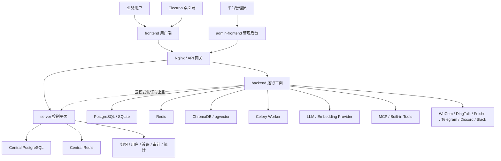
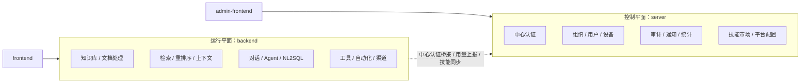
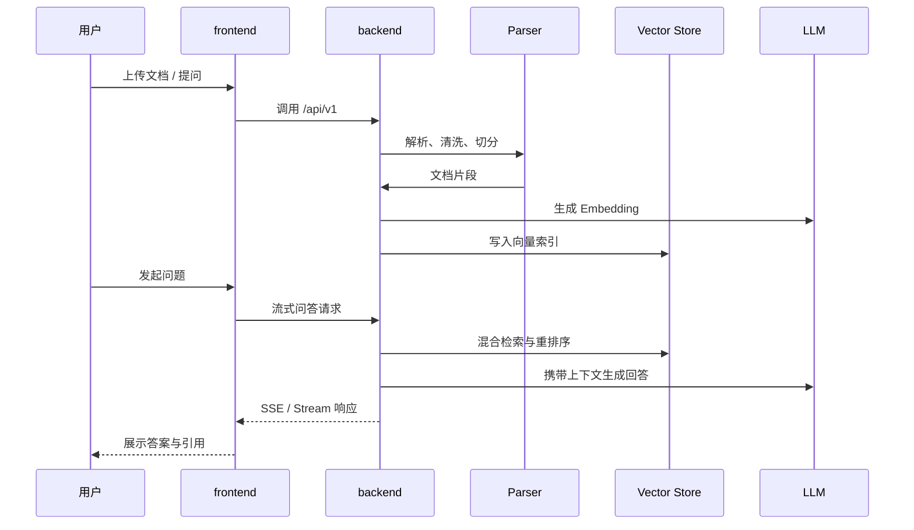
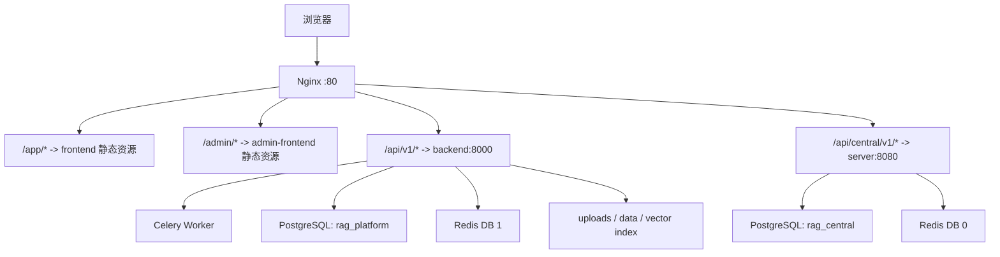

# 知枢 RAG 智能知识平台

知枢是一个面向企业知识管理、智能问答和知识服务发布场景的 RAG 平台。项目将文档、数据库、模型、工具、Agent、工作空间和多渠道接入整合到一套可本地运行、可云端部署的知识服务系统中。

当前仓库已经整理为开源发布版本，包含用户端、管理后台、节点运行后端、中心控制服务、共享库、桌面端封装和统一部署配置。

## 核心能力

### 知识管理
- 支持 PDF、Word、Excel、PPT、Markdown、HTML、TXT、图片等多格式解析。
- 支持固定长度、段落、递归、标题等多种切分策略。
- 支持文档去重、分块编辑、向量重建、知识库导入导出。
- 支持数据库数据源同步，将结构化数据转为可检索知识片段。

### 检索与问答
- 向量检索 + BM25 混合召回。
- 查询改写、多查询扩展、重排序。
- 流式智能问答与多轮上下文管理。
- 自然语言转 SQL。
- 用户记忆、画像和工作空间上下文注入。

### Agent 与工具
- MCP 工具接入。
- Prompt 技能、技能链和自动化任务。
- 多 Agent 协作问答。
- 浏览器工具、沙箱代码执行、文件分析、知识搜索等内置工具。
- 语音输入与 TTS 朗读。

### 平台与部署
- 工作空间协作。
- 应用发布与分享。
- 企业微信、钉钉、飞书、Telegram、Discord、Slack 等渠道接入。
- 系统诊断、健康检查、审计、统计和管理后台。
- Electron 桌面端封装。

## 架构图

### 1. 总体架构



### 2. 控制平面与运行平面边界



### 3. RAG 主链路



### 4. 统一部署拓扑



## 架构说明

### 双后端职责

| 模块 | 定位 | 主要职责 |
|---|---|---|
| `backend` | 运行平面 | 知识库、文档处理、检索、对话、Agent、工具、渠道、自动化、节点运行时 |
| `server` | 控制平面 | 中心认证、组织、用户、设备、审计、通知、统计、技能市场、管理后台 API |

### 双前端职责

| 模块 | 面向对象 | 默认访问 |
|---|---|---|
| `frontend` | 普通业务用户 | `backend`，统一部署路径为 `/api/v1/*` |
| `admin-frontend` | 平台或组织管理员 | `server`，统一部署路径为 `/api/central/v1/*` |

### 部署模式

| 模式 | 组成 | 适用场景 |
|---|---|---|
| 本地/桌面模式 | `backend` + `frontend` + `desktop` | 单机知识助手、本地资料问答、演示环境 |
| 云端统一部署 | `server` + `admin-frontend` + `backend` + `frontend` + `nginx` | 多用户、多组织、统一管理与发布 |
| 节点运行模式 | 多个 `backend` 节点连接中心 `server` | 多节点知识服务、集中认证与用量上报 |

## 项目结构

```text
backend/          RAG 主后端，包含知识库、文档处理、检索、对话、Agent、工具和渠道能力
server/           中心服务器，包含组织、用户、设备、审计、通知、统计和平台管理能力
frontend/         Vue 3 用户端前端，面向知识库、问答、模型、工作空间和发布应用
admin-frontend/   Vue 3 管理后台，面向组织、用户、设备、统计和平台配置
shared/           共享 Python 包，提供密码、JWT、加密、分页和权限工具
shared-frontend/  共享前端工具包，提供 JWT、请求封装和权限工具
desktop/          Electron 桌面端封装与本地运行入口
deploy/           生产部署 Compose、Nginx 和初始化脚本
nginx/            本地全栈部署 Nginx 配置
website/          项目静态官网
doc/adr/          架构决策记录
```

## 技术栈

### 后端与任务
- Python 3.11+
- FastAPI
- SQLAlchemy Async
- Alembic
- PostgreSQL / SQLite
- Redis
- Celery
- ChromaDB / pgvector

### 前端
- Vue 3
- TypeScript
- Vite
- Element Plus
- Pinia
- lucide-vue-next

### 桌面与部署
- Electron
- PyInstaller
- Docker Compose
- Nginx

## 快速启动

### 1. 启动节点后端

```bash
cd backend
pip install -r requirements.txt
python desktop_main.py
```

默认以桌面/本地模式启动，服务地址通常为 `http://127.0.0.1:8000`。

### 2. 启动用户端前端

```bash
cd shared-frontend
npm install
npm run build

cd ../frontend
npm install
npm run dev
```

默认开发地址：

- 用户端：`http://127.0.0.1:3000`
- 节点后端：`http://127.0.0.1:8000`

### 3. 启动中心服务

```bash
cd server
pip install -r requirements.txt
python run.py
```

默认开发地址：

- 中心服务：`http://127.0.0.1:8080`

### 4. 启动管理后台

```bash
cd shared-frontend
npm run build

cd ../admin-frontend
npm install
npm run dev
```

默认开发地址：

- 管理后台：`http://127.0.0.1:5173`
- 中心服务：`http://127.0.0.1:8080`

## 生产部署

统一部署适合将官网、用户端、管理后台、节点后端、中心服务和基础设施都放在同一套 Nginx 入口之后。

```bash
# 1. 准备环境变量
cp .env.example .env

# 2. 构建前端静态资源
docker compose -f deploy/docker-compose.prod.yml --profile build run --rm frontend-build
docker compose -f deploy/docker-compose.prod.yml --profile build run --rm admin-build
docker compose -f deploy/docker-compose.prod.yml --profile build run --rm website-copy

# 3. 启动服务
docker compose -f deploy/docker-compose.prod.yml up -d
```

关键路由：

| 路径 | 目标 |
|---|---|
| `/` | 静态官网 |
| `/app/` | 用户端前端 |
| `/admin/` | 管理后台 |
| `/api/v1/` | `backend` |
| `/api/central/v1/` | `server` |

## 环境变量

常用配置入口：

| 文件 | 说明 |
|---|---|
| `.env.example` | 根目录示例配置 |
| `backend/.env.example` | 节点后端配置模板 |
| `server/.env.example` | 中心服务配置模板 |
| `frontend/.env.example` | 用户端开发代理配置 |
| `admin-frontend/.env.example` | 管理后台开发代理配置 |
| `deploy/.env.example` | 生产部署配置模板 |

生产环境必须设置强随机 `SECRET_KEY`，并按部署形态配置数据库、Redis、CORS、模型供应商和管理员账号。

## 构建验证

```bash
cd shared-frontend
npm run build

cd ../frontend
npm run build

cd ../admin-frontend
npm run build
```

后端可以通过启动服务和访问健康检查接口确认运行状态：

- `backend`: `/api/v1/health`
- `server`: `/api/v1/health`

## 使用流程

### 首次使用

1. 登录系统。
2. 配置 LLM 模型与 Embedding 模型。
3. 创建知识库。
4. 上传文档或同步数据库数据源。
5. 进入智能对话页面进行问答。

### 多 Agent 协作

1. 创建 Agent，并为不同 Agent 绑定知识库和模型。
2. 在智能对话中选择多 Agent 模式。
3. 提出跨知识库问题。
4. 系统会分发任务、汇总证据并生成最终回答。

### 应用发布与渠道接入

1. 在知识库或应用页面配置发布参数。
2. 生成分享入口或 API Key。
3. 按需接入企业微信、钉钉、飞书、Telegram、Discord、Slack 等渠道。
4. 在管理后台查看用量、审计和平台状态。

## 关键文档

### 架构决策记录

- `doc/adr/001-system-boundary.md`：Backend / Server 职责边界。
- `doc/adr/002-database-strategy.md`：数据库与存储策略。
- `doc/adr/003-api-design-conventions.md`：API 设计规范。
- `doc/adr/004-vector-store-selection.md`：向量存储选型。
- `doc/adr/005-workspace-data-source.md`：Workspace 数据源与同步策略。

### 说明材料

- `README.en.md`：英文说明。
- `CONTRIBUTING.md`：贡献指南。
- `CHANGELOG.md`：变更记录。
- `doc/答辩准备/`：项目说明、架构、数据库设计和答辩材料。

## 开源说明

本仓库发布的是当前可运行源码快照，不包含本地 `.env`、运行数据、缓存、上传文件、证书、私钥和测试脚本。请勿将生产环境密钥、数据库文件或上传资料提交到仓库。

## 贡献

欢迎通过 Issue、功能分支或 Pull Request 参与改进。

推荐流程：

1. Fork 仓库。
2. 创建功能分支。
3. 提交修改。
4. 发起 Pull Request。

## 许可证

当前仓库采用 MIT License，详见根目录 `LICENSE` 文件。
