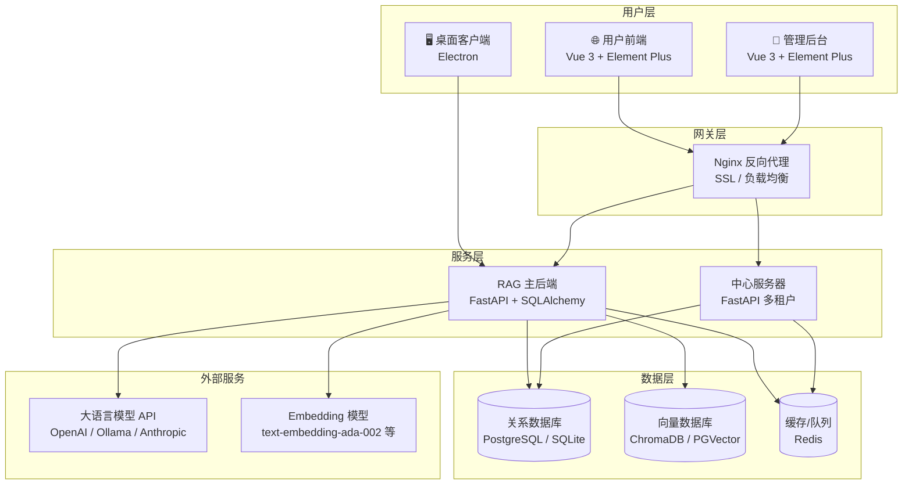
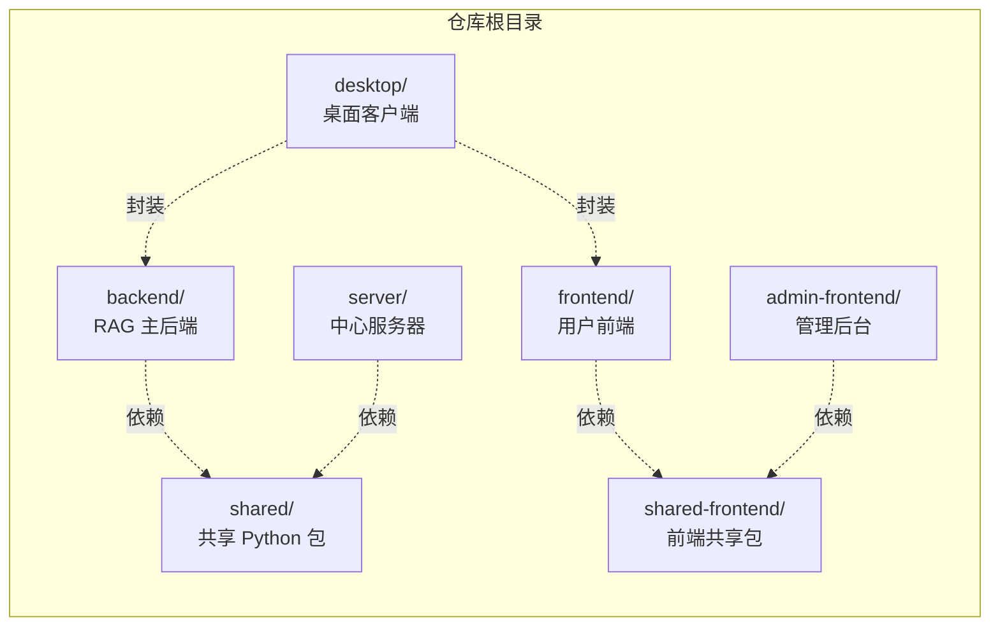
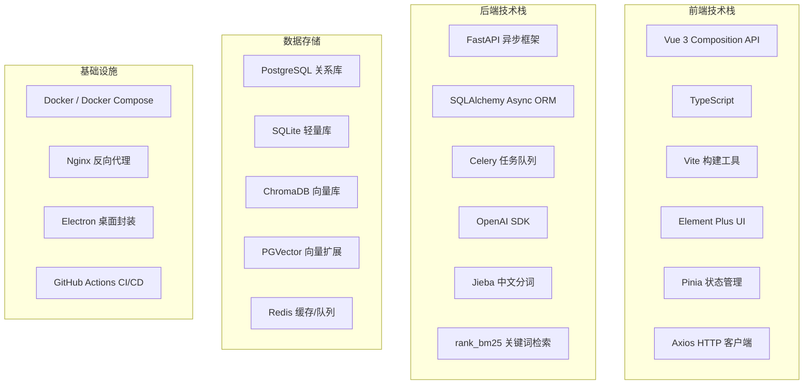
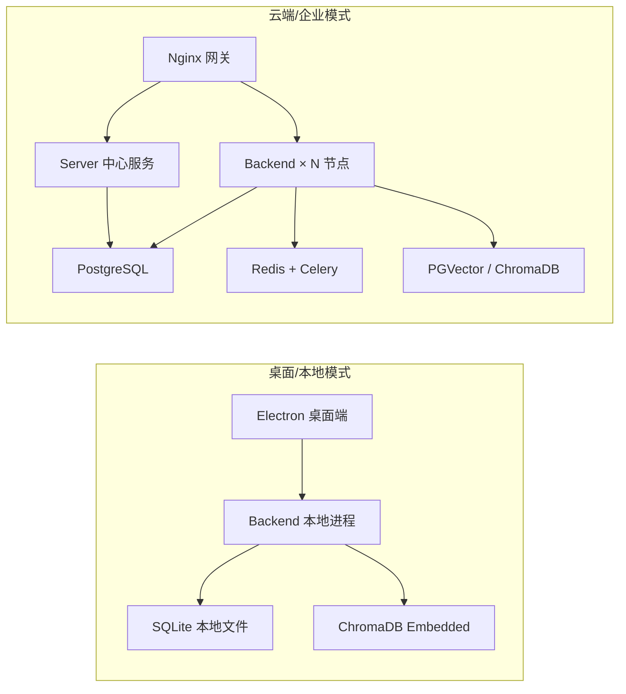
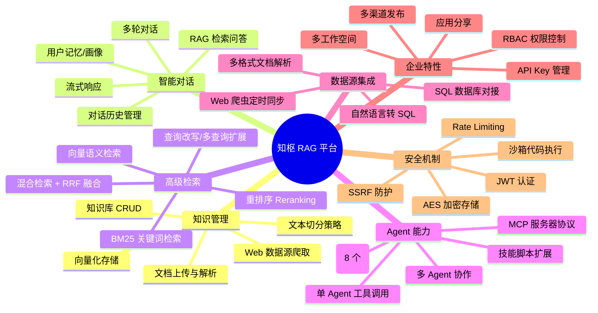
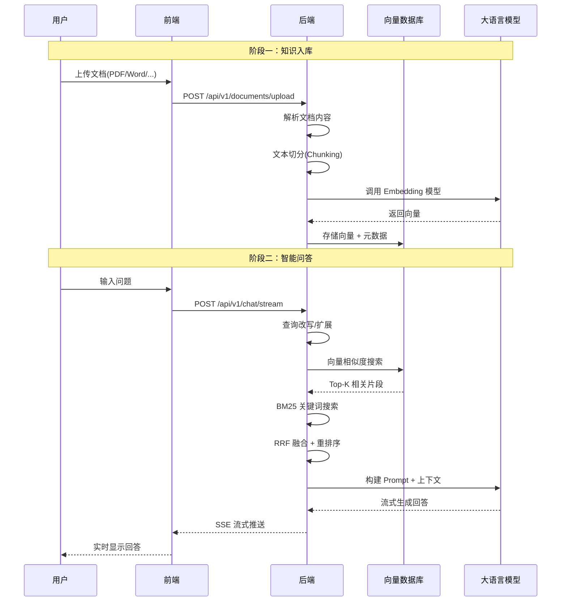

# 知枢 RAG 智能知识平台 — 项目总览

## 一、项目简介

**知枢**是一个面向企业知识管理与智能问答的 **RAG（Retrieval-Augmented Generation，检索增强生成）** 平台。它将企业内部文档（PDF、Word、Excel、PPT、Markdown 等）转化为可检索的知识库，结合大语言模型（LLM）实现精准的智能问答。

> **一句话概括**：上传文档 → 自动解析切分 → 向量化存储 → 用户提问 → 检索相关知识 → LLM 生成回答

---

## 二、系统架构总览

---

## 三、仓库结构（6 大子模块）

| 子模块 | 技术栈 | 职责 |
|--------|--------|------|
| **backend/** | Python 3.11+, FastAPI, SQLAlchemy Async, Celery | RAG 核心引擎：文档处理、检索、对话、Agent |
| **server/** | Python 3.11+, FastAPI | 多租户中心服务：组织管理、设备注册、技能市场 |
| **shared/** | Python (rag_platform_common) | 共享工具包：密码、JWT、加密、分页 |
| **frontend/** | Vue 3, TypeScript, Vite, Element Plus, Pinia | 用户端 SPA：知识库、对话、模型配置等 |
| **admin-frontend/** | Vue 3, Element Plus | 管理后台：用户管理、组织管理、数据统计 |
| **desktop/** | Electron | 桌面客户端封装，支持本地离线运行 |
| **shared-frontend/** | TypeScript | 前端共享工具：JWT 解析、Axios 拦截器 |

---

## 四、完整技术栈

---

## 五、两种部署模式

| 对比维度 | 桌面模式 | 云端模式 |
|----------|----------|----------|
| **目标用户** | 个人/小团队 | 企业/多团队 |
| **数据库** | SQLite | PostgreSQL |
| **向量存储** | ChromaDB Embedded | PGVector / ChromaDB Server |
| **缓存** | 内存回退 | Redis |
| **任务队列** | 同步执行 | Celery + Redis |
| **多租户** | 单用户 | 支持组织/工作空间隔离 |
| **网络** | 本地 localhost | Nginx + HTTPS |

---

## 六、核心功能模块

---

## 七、用户使用流程

---

> 📌 **下一步**：阅读 `02-RAG核心原理.md` 深入理解检索增强生成的技术细节。
