# RAG 核心原理与技术细节

## 一、什么是 RAG？

**RAG（Retrieval-Augmented Generation，检索增强生成）** 是一种将 **信息检索** 与 **大语言模型生成** 相结合的技术范式。

### 传统 LLM 的局限性

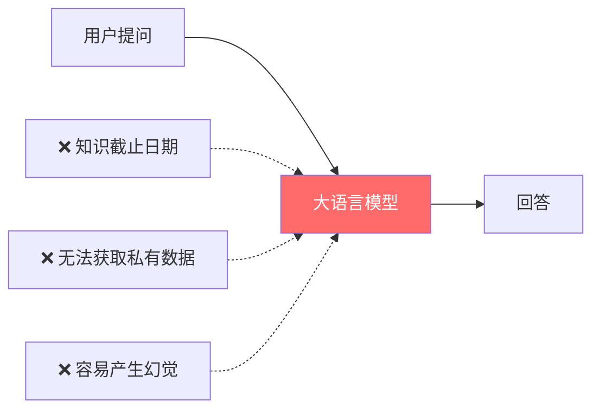

### RAG 的解决方案

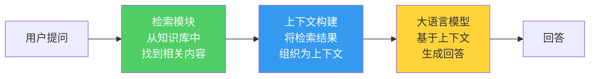

> **核心思想**：不修改模型参数，而是在推理时动态注入外部知识，让 LLM "有据可查" 地回答问题。

---

## 二、RAG 完整流程（本项目实现）

### 2.1 离线阶段：知识入库

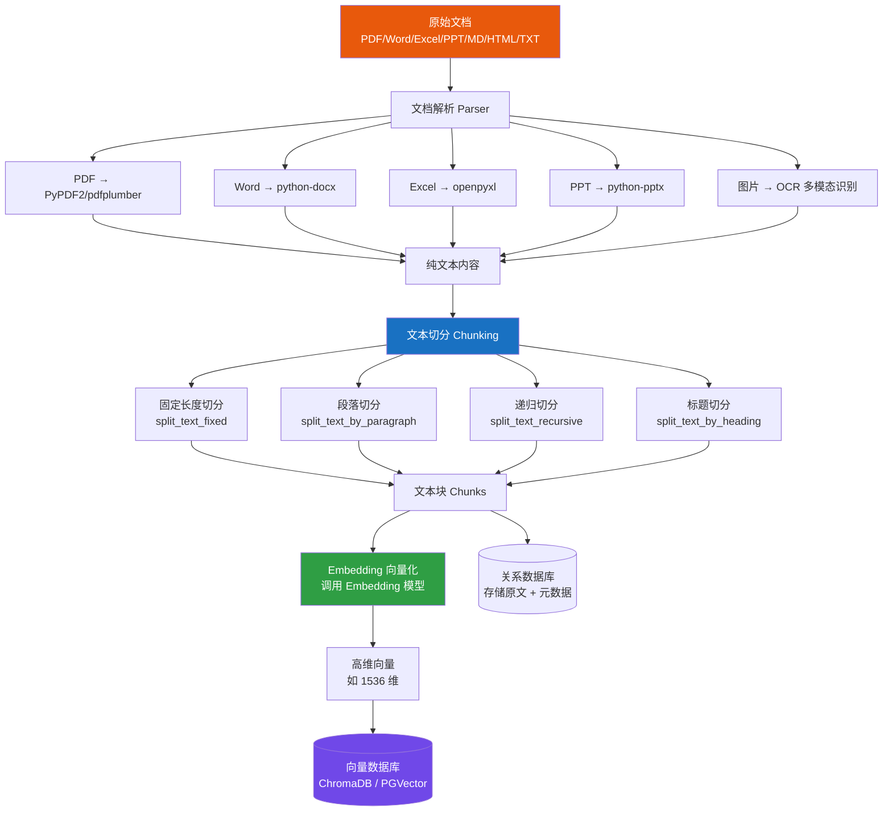

### 2.2 在线阶段：检索问答

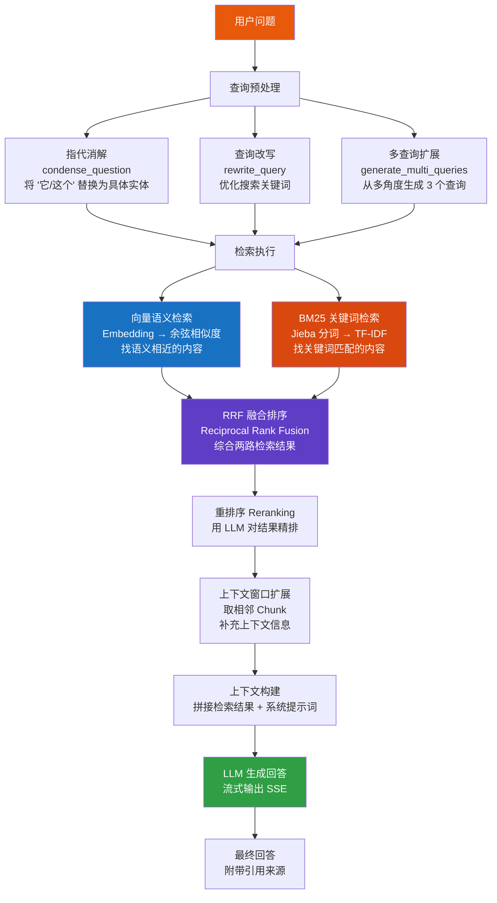

---

## 三、关键技术详解

### 3.1 文本切分（Chunking）

**为什么要切分？** LLM 有上下文长度限制，且过长文本会稀释关键信息。切分后每个 Chunk 包含一个相对独立的语义单元。

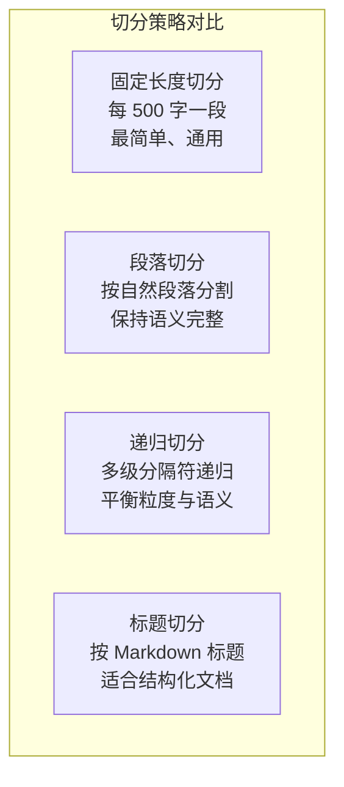

**重叠窗口（Overlap）机制**：
```
Chunk 1: [=============================]
Chunk 2:              [=============================]
Chunk 3:                           [=============================]
                       ↑ 重叠区域 ↑
```
- 默认 chunk_size = 500, overlap = 50
- 重叠确保边界处的信息不会因切分而丢失

### 3.2 Embedding 向量化

**原理**：将文本映射到高维向量空间，语义相似的文本在向量空间中距离更近。

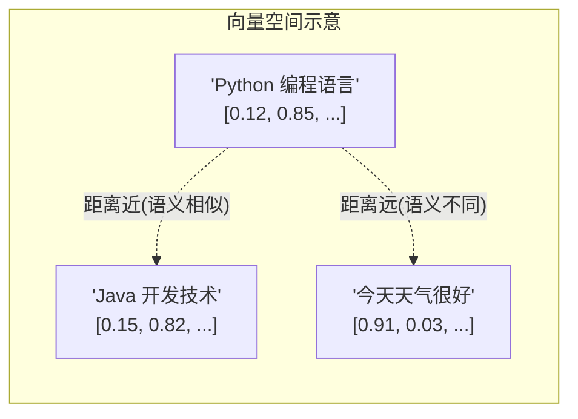

**本项目支持的 Embedding 模型**：
- **OpenAI**: text-embedding-ada-002 (1536维), text-embedding-3-small/large
- **本地模型**: 通过 Ollama 部署的 Embedding 模型
- **平台内置**: 可配置统一的 Embedding 服务

### 3.3 向量检索（Vector Search）

**余弦相似度**：衡量两个向量方向的一致性

$$
\text{cosine\_similarity}(\vec{A}, \vec{B}) = \frac{\vec{A} \cdot \vec{B}}{|\vec{A}| \times |\vec{B}|}
$$

值域 [-1, 1]，越接近 1 表示越相似。

**本项目的向量存储抽象**：
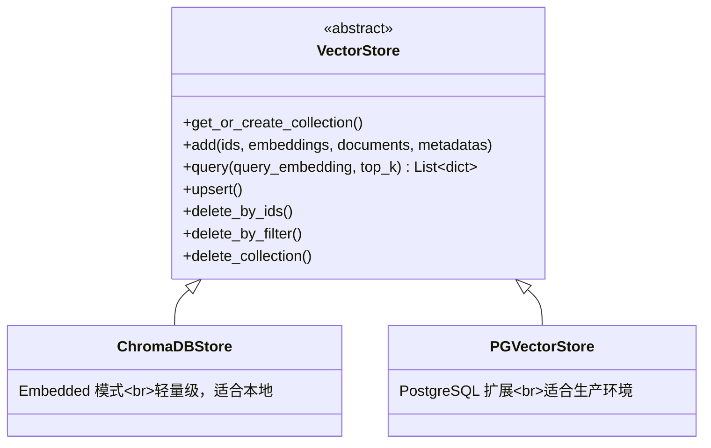

### 3.4 BM25 关键词检索

**BM25（Best Matching 25）** 是经典的基于词频的文本检索算法：

$$
\text{BM25}(q, d) = \sum_{t \in q} \text{IDF}(t) \cdot \frac{f(t,d) \cdot (k_1 + 1)}{f(t,d) + k_1 \cdot (1 - b + b \cdot \frac{|d|}{\text{avgdl}})}
$$

- **IDF(t)**：逆文档频率，衡量词的区分度
- **f(t,d)**：词 t 在文档 d 中的出现频次
- **k₁, b**：调节参数

**本项目实现特点**：
- 使用 **Jieba** 进行中文分词
- BM25 索引有 **LRU 缓存**（TTL=300s，最大 32 个知识库索引）
- CPU 密集计算放入 **线程池** 避免阻塞事件循环

### 3.5 混合检索与 RRF 融合

**为什么需要混合检索？**

| 检索方式 | 优势 | 劣势 |
|----------|------|------|
| **向量检索** | 理解语义，"意思相近"即可匹配 | 对专有名词、编号不敏感 |
| **BM25 关键词** | 精确匹配关键词、编号 | 无法理解同义词、语义 |

**RRF（Reciprocal Rank Fusion）融合算法**：

$$
\text{RRF\_score}(d) = \sum_{r \in R} \frac{w_r}{k + \text{rank}_r(d)}
$$

- k = 60（平滑常数）
- 对每个文档，综合其在各检索列表中的排名
- 排名越靠前，得分越高

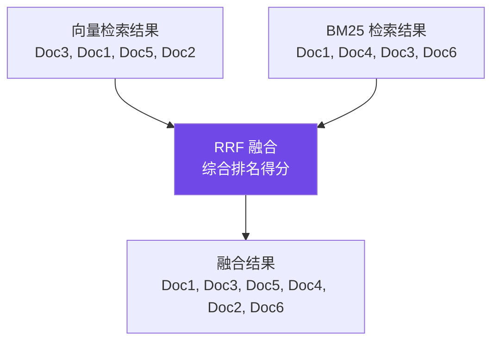

### 3.6 查询改写（Query Rewriting）

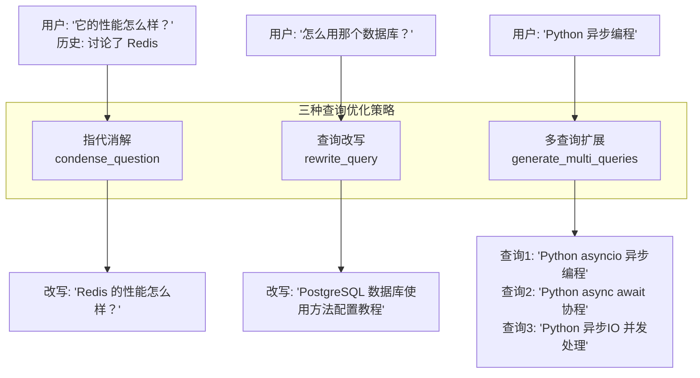

### 3.7 上下文管理引擎

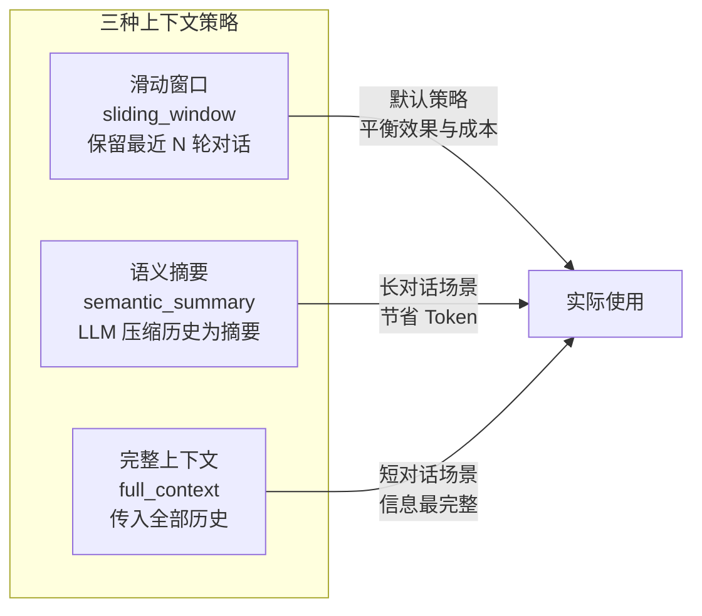

---

## 四、与传统方案的对比

### 4.1 RAG vs 微调（Fine-tuning）

| 对比维度 | RAG | 微调 |
|----------|-----|------|
| **知识更新** | ✅ 实时更新，修改文档即可 | ❌ 需重新训练模型 |
| **成本** | ✅ 低，只需向量化文档 | ❌ 高，需要 GPU 训练 |
| **可溯源** | ✅ 可追溯到原始文档 | ❌ 知识融入参数，不可追溯 |
| **幻觉控制** | ✅ 有上下文约束 | ❌ 仍可能产生幻觉 |
| **专业深度** | ⚠️ 依赖检索质量 | ✅ 深度理解领域知识 |

### 4.2 RAG vs 长上下文模型

| 对比维度 | RAG | 长上下文 (128K+) |
|----------|-----|-------------------|
| **知识库规模** | ✅ 无限制 | ❌ 受窗口限制 |
| **成本** | ✅ 只传相关片段 | ❌ Token 消耗巨大 |
| **精确度** | ✅ 检索聚焦 | ⚠️ 长文本中可能遗漏 |
| **延迟** | ✅ 检索快速 | ❌ 长上下文推理慢 |

---

## 五、本项目的技术创新点

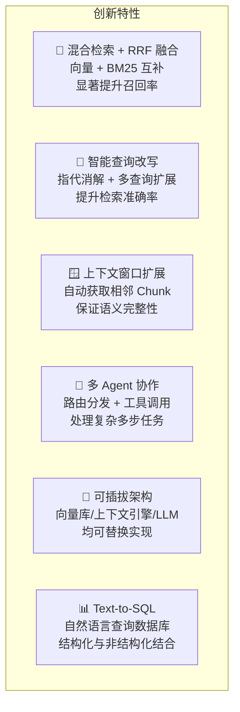

---

> 📌 **下一步**：阅读 `03-后端架构详解.md` 了解后端的分层设计与核心服务实现。
