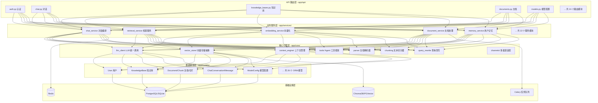
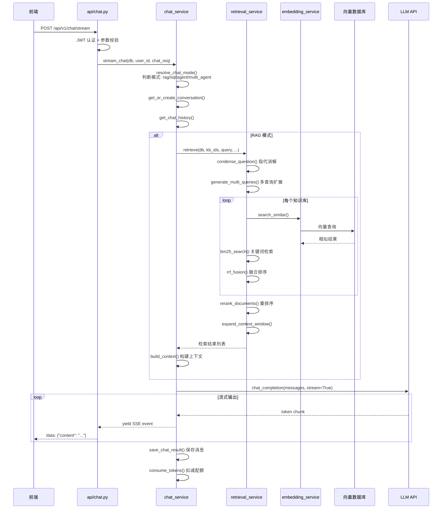
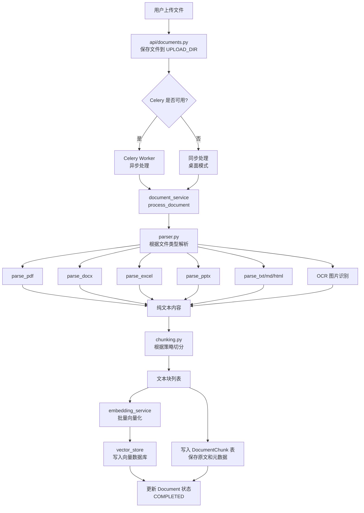
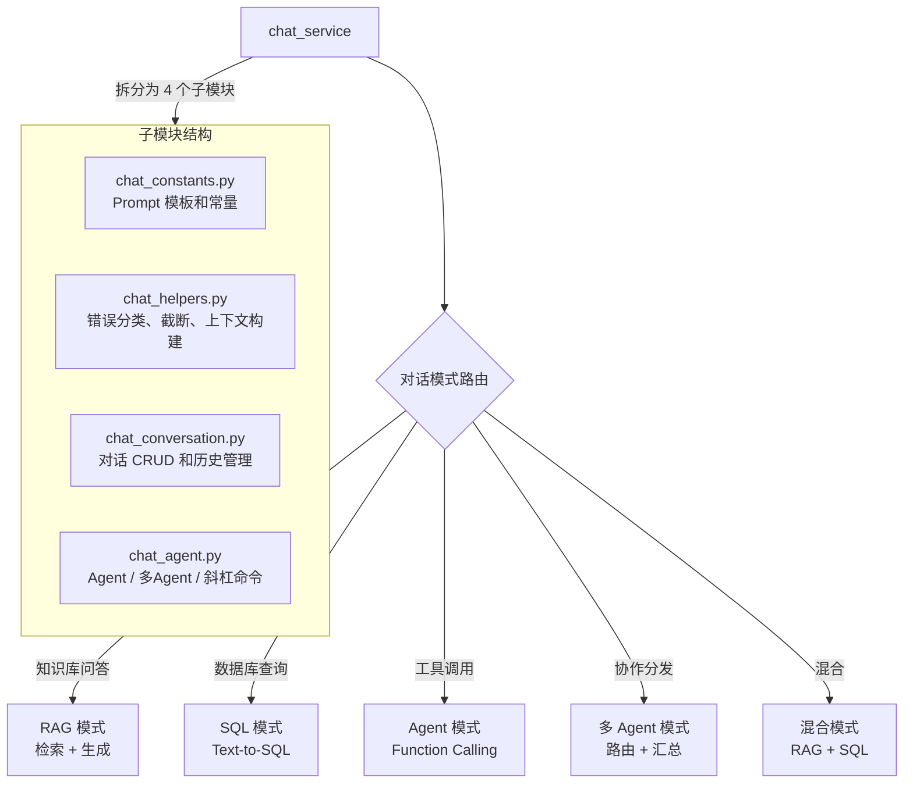
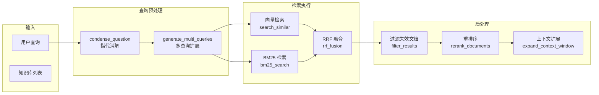
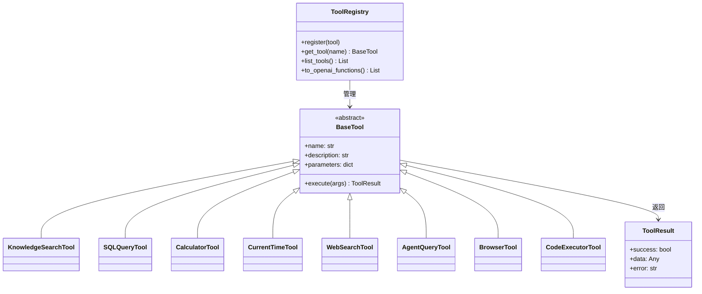
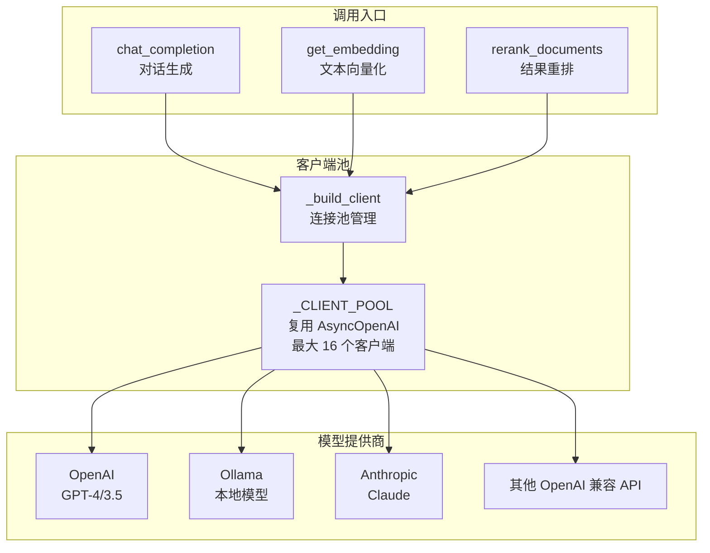
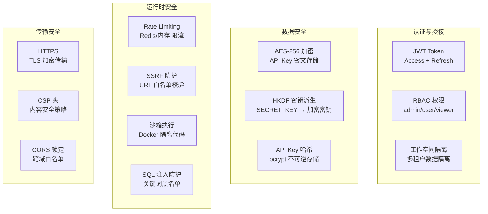
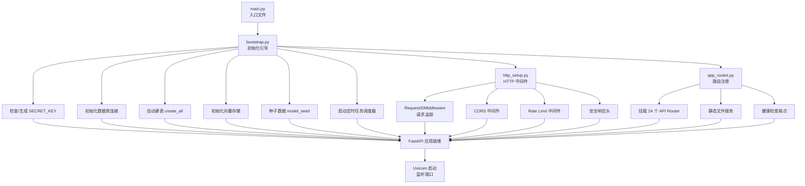

# 后端架构详解

## 一、整体分层架构

---

## 二、请求处理流程

### 2.1 一次完整的 Chat 请求

### 2.2 文档处理流程

---

## 三、核心服务模块详解

### 3.1 对话服务 (chat_service.py)

**五种对话模式**：

| 模式 | 触发条件 | 流程 |
|------|----------|------|
| **RAG** | 关联知识库 | 检索知识库 → 构建上下文 → LLM 生成 |
| **SQL** | 关联数据库源 | 自然语言 → SQL → 执行 → 解读结果 |
| **Agent** | 启用 Agent 模式 | LLM 决定调用工具 → 执行 → 返回 |
| **Multi-Agent** | 配置多 Agent | 路由分发子问题 → 各 Agent 处理 → 汇总 |
| **Hybrid** | 同时关联 KB + DB | RAG + SQL 并行检索 → 融合生成 |

### 3.2 检索服务 (retrieval_service.py)

### 3.3 Agent 工具框架 (core/tools/)

**8 个内置工具**：

| 工具名 | 功能 | 使用场景 |
|--------|------|----------|
| **knowledge_search** | 搜索知识库 | 回答需要查阅文档的问题 |
| **sql_query** | 执行 SQL 查询 | 查询结构化数据 |
| **calculator** | 数学计算 | 精确数值计算 |
| **current_time** | 获取当前时间 | 时间相关问题 |
| **web_search** | 网络搜索 | 查找实时信息 |
| **agent_query** | 调用其他 Agent | 多 Agent 协作中的子任务分发 |
| **browser_tool** | 网页内容提取 | 读取指定 URL 内容 |
| **code_executor** | 沙箱执行代码 | 运行 Python 代码 |

---

## 四、LLM 调用统一层 (llm_client.py)

**关键设计**：
- **连接池复用**：按 (base_url, api_key_hash) 缓存客户端，避免重复创建连接
- **API Key 加密存储**：数据库中存密文，调用时解密
- **统一接口**：所有 LLM 通过 OpenAI SDK 的兼容协议调用

---

## 五、安全机制

---

## 六、应用启动流程

---

> 📌 **下一步**：阅读 `04-前端架构详解.md` 了解前端的组件设计与交互流程。
