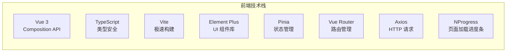
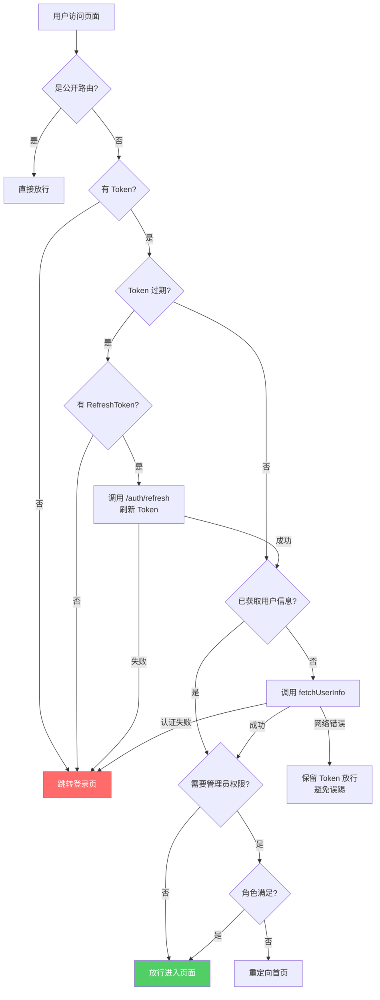
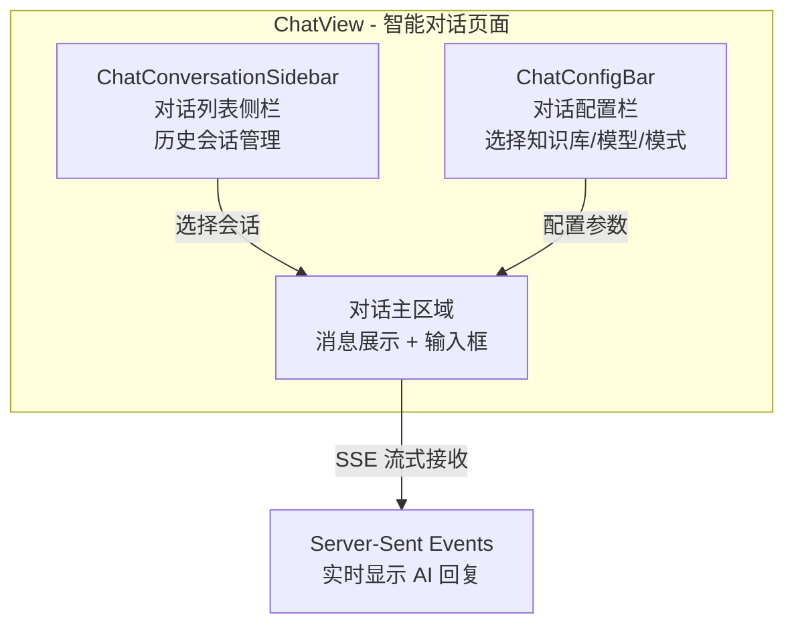
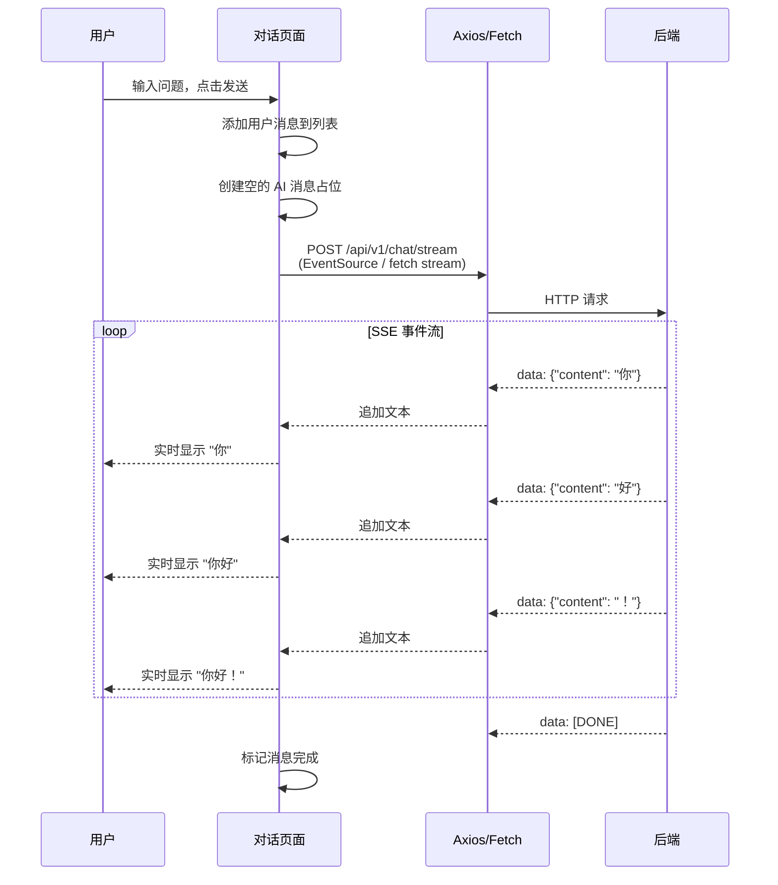
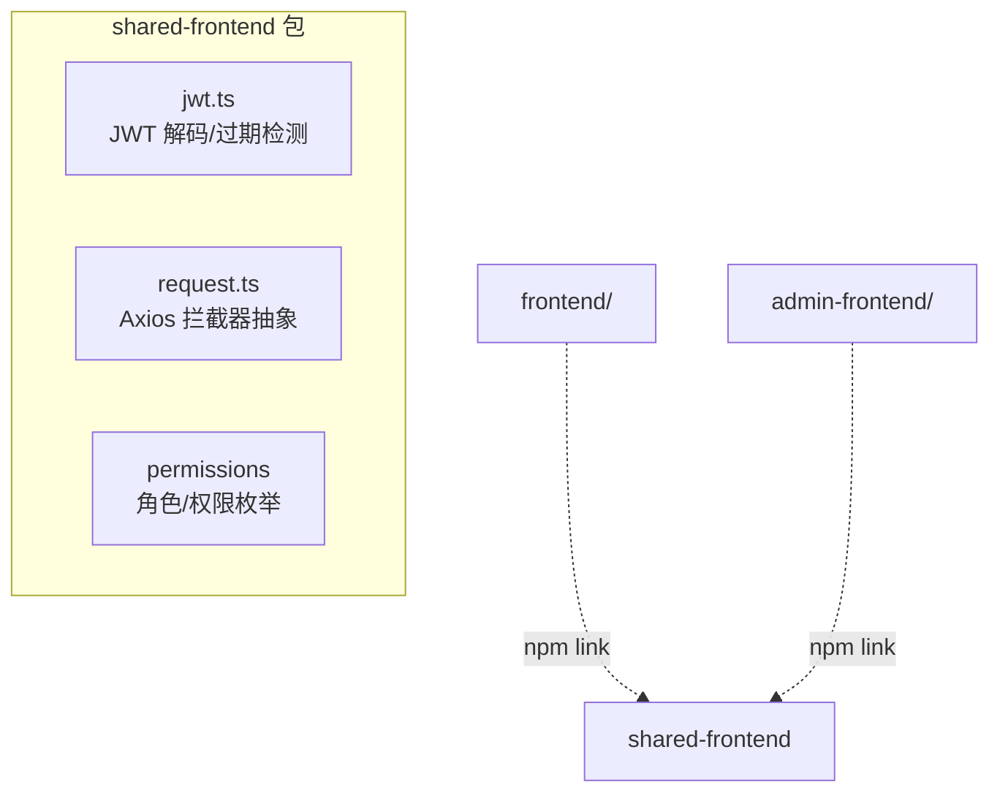

# 前端架构详解

## 一、技术栈概览



---

## 二、项目结构

```
frontend/src/
├── App.vue                 # 根组件
├── main.ts                 # 入口文件（挂载 Vue 实例）
├── router/index.ts         # 路由配置 + 导航守卫
├── stores/                 # Pinia 状态管理
│   └── user.ts             # 用户认证状态
├── api/                    # 后端 API 封装（16 个模块）
│   ├── auth.ts             # 认证 API
│   ├── chat.ts             # 对话 API
│   ├── knowledge.ts        # 知识库 API
│   ├── documents.ts        # 文档 API
│   ├── models.ts           # 模型 API
│   └── ...
├── components/             # 公共组件
│   ├── layout/             # 布局组件（顶栏、侧栏）
│   └── chat/               # 对话相关组件
├── views/                  # 页面视图（30 个）
│   ├── login/              # 登录页
│   ├── knowledge/          # 知识库管理
│   ├── documents/          # 文档管理
│   ├── chat/               # 智能对话（核心页面）
│   ├── retrieval/          # 检索测试
│   ├── models/             # 模型管理
│   ├── apps/               # 应用发布
│   ├── agents/             # 多 Agent 协作
│   └── ...
├── utils/                  # 工具函数
│   ├── jwt.ts              # JWT 解析
│   ├── apiBase.ts          # API 基础 URL
│   └── request.ts          # Axios 封装
└── styles/                 # 全局样式
```

---

## 三、路由设计

```mermaid
graph TD
    ROOT["/"] --> LAYOUT[Layout 布局组件<br/>侧栏 + 顶栏 + 内容区]
    
    LAYOUT --> K[/knowledge<br/>知识库管理]
    LAYOUT --> D[/knowledge/:id/documents<br/>文档管理]
    LAYOUT --> CH[/chat<br/>智能对话 ⭐]
    LAYOUT --> RT[/retrieval<br/>检索测试]
    LAYOUT --> MD[/models<br/>模型管理]
    LAYOUT --> DB[/databases<br/>数据库管理]
    LAYOUT --> AP[/apps<br/>应用发布]
    LAYOUT --> CN[/channels<br/>渠道管理]
    LAYOUT --> SK[/skills<br/>技能市场]
    LAYOUT --> AT[/automations<br/>自动化任务]
    LAYOUT --> AG[/agents<br/>多Agent协作]
    LAYOUT --> MC[/mcp<br/>MCP服务器]
    LAYOUT --> DG[/diagnostics<br/>系统诊断]
    LAYOUT --> WK[/workspaces<br/>工作空间]
    LAYOUT --> SY[/system<br/>系统管理 🔒Admin]
    LAYOUT --> ST[/settings<br/>个人设置]
    LAYOUT --> AU[/admin/users<br/>用户管理 🔒Admin]
    
    LOGIN[/login<br/>登录页] -.公开路由.-> ROOT
    SHARE[/share/:token<br/>分享问答] -.公开路由.-> ROOT
    INVITE[/invite/:token<br/>加入工作空间] -.公开路由.-> ROOT
```

### 路由守卫机制



---

## 四、状态管理（Pinia）

```mermaid
graph TD
    subgraph UserStore
        STATE[状态 State]
        STATE --> S1[token: string]
        STATE --> S2[refreshToken: string]
        STATE --> S3[userInfo: 用户信息对象]
        
        ACTIONS[动作 Actions]
        ACTIONS --> A1[setToken() 存储 Token]
        ACTIONS --> A2[clearToken() 清除登录态]
        ACTIONS --> A3[fetchUserInfo() 获取用户信息]
        ACTIONS --> A4[setRefreshToken() 存储刷新令牌]
        
        GETTERS[计算属性 Getters]
        GETTERS --> G1[isLoggedIn 是否已登录]
        GETTERS --> G2[isAdmin 是否管理员]
    end
    
    LS[(localStorage)] <-.持久化.-> STATE
```

---

## 五、核心页面 — 智能对话



### 流式对话的前端实现



---

## 六、API 封装层

```mermaid
graph LR
    subgraph API 模块 (frontend/src/api/)
        A1[auth.ts<br/>登录/注册/刷新]
        A2[chat.ts<br/>对话/历史/流式]
        A3[knowledge.ts<br/>知识库 CRUD]
        A4[documents.ts<br/>文档上传/管理]
        A5[models.ts<br/>模型配置]
        A6[apps.ts<br/>应用发布]
        A7[channels.ts<br/>渠道管理]
        A8[databases.ts<br/>数据源管理]
        A9[workspaces.ts<br/>工作空间]
        A10[skills.ts<br/>技能市场]
        A11[agents.ts<br/>Agent 配置]
        A12[其他...]
    end
    
    subgraph 请求基础层
        REQ[utils/request.ts<br/>Axios 实例<br/>统一拦截器]
        BASE[utils/apiBase.ts<br/>API_V1 基础路径]
    end
    
    A1 & A2 & A3 & A4 & A5 --> REQ
    REQ --> BASE
    BASE --> |/api/v1| BE[后端 API]
```

**Axios 拦截器功能**：
- **请求拦截**：自动附加 JWT Token 到 Authorization 头
- **响应拦截**：401 时自动尝试 Token 刷新，失败则跳转登录

---

## 七、前端共享包 (shared-frontend/)



---

> 📌 **下一步**：阅读 `05-数据库设计.md` 了解数据模型与表关系。
