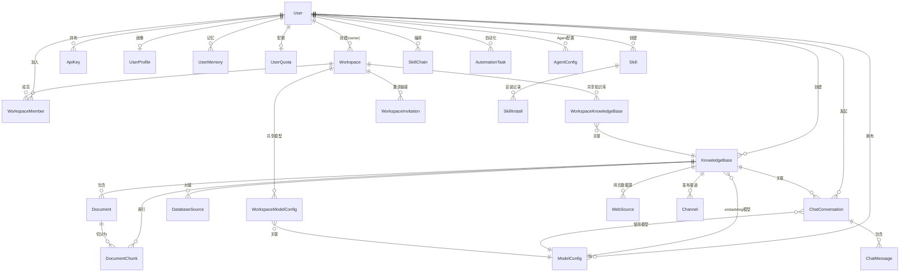
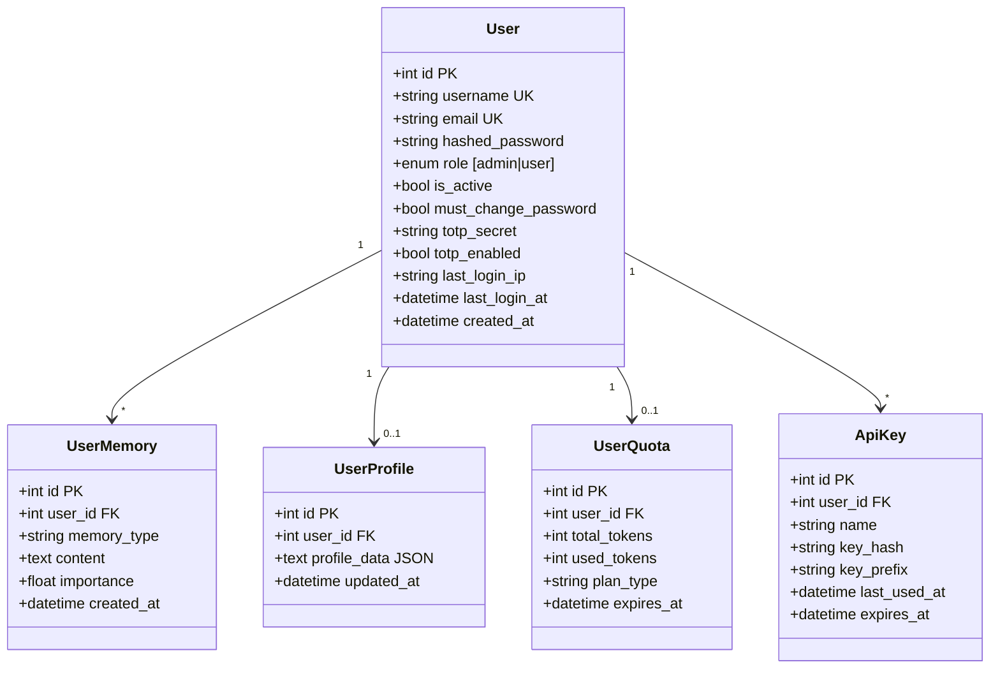
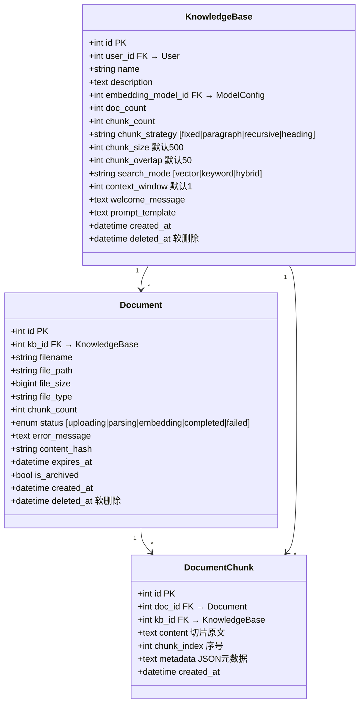
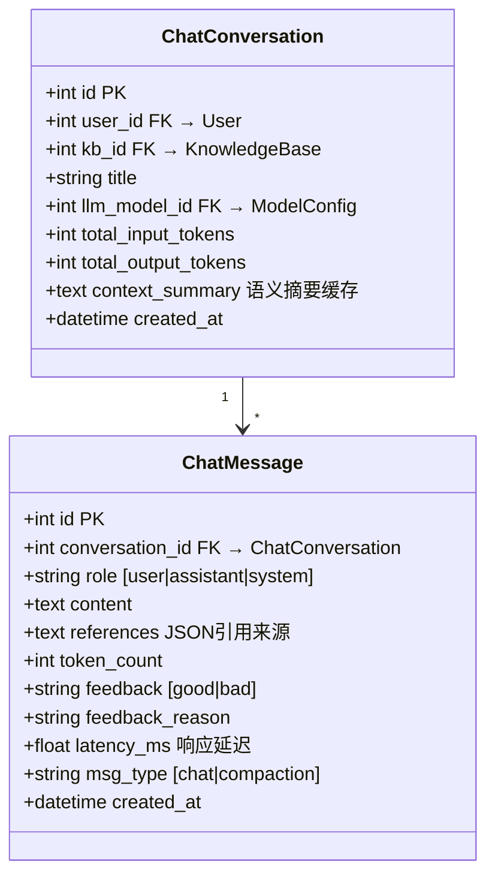
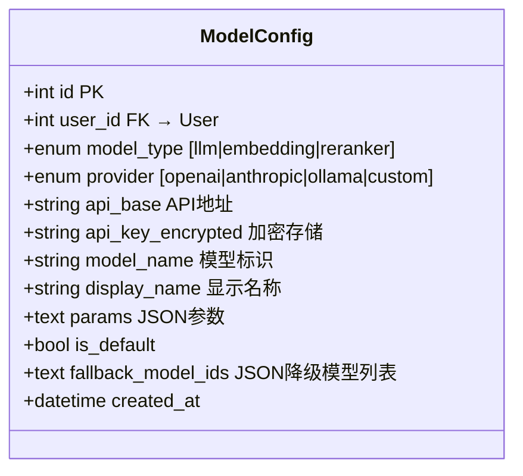
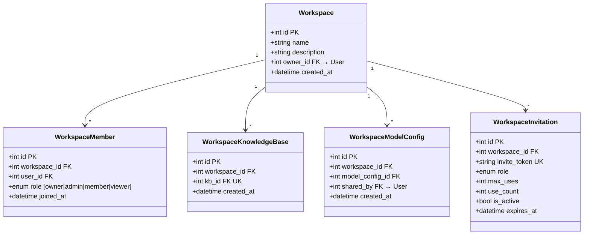
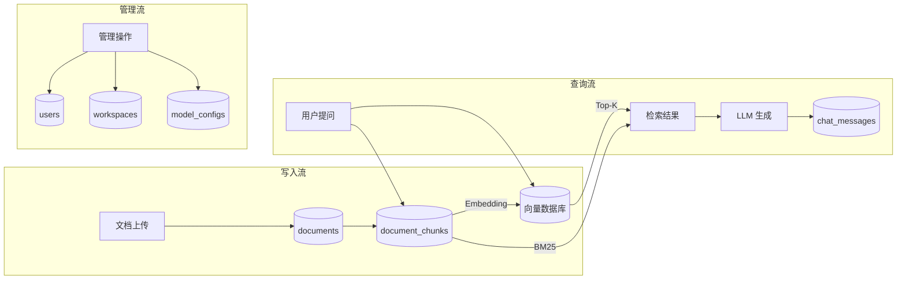

# 数据库设计

## 一、数据库选型

| 场景 | 数据库 | 用途 |
|------|--------|------|
| **桌面/本地模式** | SQLite | 轻量级，零配置，单文件存储 |
| **云端/企业模式** | PostgreSQL | 高并发，支持事务，企业级可靠性 |
| **向量存储（本地）** | ChromaDB Embedded | 嵌入式运行，无需单独部署 |
| **向量存储（生产）** | PGVector | PostgreSQL 扩展，统一运维 |
| **缓存/队列** | Redis | Token 黑名单、限流、Celery 消息队列 |

> 关系数据库使用 **SQLAlchemy Async ORM**，通过异步引擎（`aiosqlite` / `asyncpg`）实现非阻塞数据库操作。

---

## 二、核心 ER 图

---

## 三、核心表结构详解

### 3.1 用户体系

### 3.2 知识管理核心

> **注意**：`DocumentChunk` 同时冗余了 `kb_id`，便于检索时直接按知识库过滤，避免 JOIN。

### 3.3 对话系统

**设计要点**：
- `total_input/output_tokens`：追踪每个对话的 Token 消耗量
- `context_summary`：语义摘要引擎的缓存，避免重复压缩
- `latency_ms`：记录每条回复延迟，用于性能监控
- `msg_type = compaction`：标记被压缩合并的历史消息

### 3.4 模型配置

**安全设计**：API Key 使用 AES-256 加密存储（`api_key_encrypted`），调用时解密。

### 3.5 工作空间（多租户）

**多租户隔离模型**：
- 不采用 schema-per-tenant，而是通过 **关联表** 实现资源共享
- 一个知识库只能属于一个工作空间（`kb_id` 有 UK 约束）
- 成员角色四级：Owner > Admin > Member > Viewer

---

## 四、完整数据模型总览（26 张表）

```mermaid
graph TD
    subgraph 用户体系 6表
        U[users]
        UP[user_profiles]
        UM[user_memories]
        UQ[user_quotas]
        UL[usage_logs]
        AK[api_keys]
    end

    subgraph 知识管理 6表
        KB[knowledge_bases]
        DOC[documents]
        DC[document_chunks]
        DS[database_sources]
        DSR[database_sync_runs]
        WS2[web_sources]
    end

    subgraph 对话系统 2表
        CC[chat_conversations]
        CM[chat_messages]
    end

    subgraph 模型配置 2表
        MC[model_configs]
        PT[prompt_templates]
    end

    subgraph 工作空间 4表
        W[workspaces]
        WM[workspace_members]
        WKB[workspace_knowledge_bases]
        WMC[workspace_model_configs]
        WI[workspace_invitations]
    end

    subgraph 扩展功能 8表
        CH[channels]
        CS[channel_sessions]
        CSH[channel_schedules]
        SK[skills]
        SI[skill_installs]
        SC[skill_chains]
        AUTO[automation_tasks]
        AUTOL[automation_logs]
        AG[agent_configs]
        MCP[mcp_server_configs]
        OL[operation_logs]
        DV[devices]
        PA[published_apps]
    end

    U --> KB & CC & MC & W & AK & UP & UM & UQ
    KB --> DOC & DC & DS & WS2 & CC & CH
    DOC --> DC
    CC --> CM
```

---

## 五、关键索引设计

| 表 | 索引 | 用途 |
|----|------|------|
| `users` | `ix_username`, `ix_email` | 登录查找 |
| `documents` | `ix_documents_kb_status` (kb_id, status) | 按知识库+状态筛选文档 |
| `document_chunks` | `ix_chunks_kb_doc` (kb_id, doc_id) | 检索时按知识库快速查找切片 |
| `chat_conversations` | `ix_conv_user_created` (user_id, created_at) | 用户对话列表排序 |
| `workspace_members` | `uq_workspace_member` (workspace_id, user_id) | 防止重复加入 |

---

## 六、数据流向图

---

> 📌 **下一步**：阅读 `06-答辩要点速查.md` 快速准备答辩问答。
