# 知枢 RAG 智能知识平台 — 答辩完整手册

> **建议阅读顺序**：第一章项目总览 → 第二章RAG原理 → 第六章答辩速查 → 第三章后端 → 第五章数据库 → 第四章前端

---

# 第一章 项目总览

## 一、项目简介

**知枢**是一个面向企业知识管理与智能问答的 **RAG（Retrieval-Augmented Generation，检索增强生成）** 平台。它将企业内部文档（PDF、Word、Excel、PPT、Markdown 等）转化为可检索的知识库，结合大语言模型（LLM）实现精准的智能问答。

> **一句话概括**：上传文档 → 自动解析切分 → 向量化存储 → 用户提问 → 检索相关知识 → LLM 生成回答

---

## 二、系统架构总览

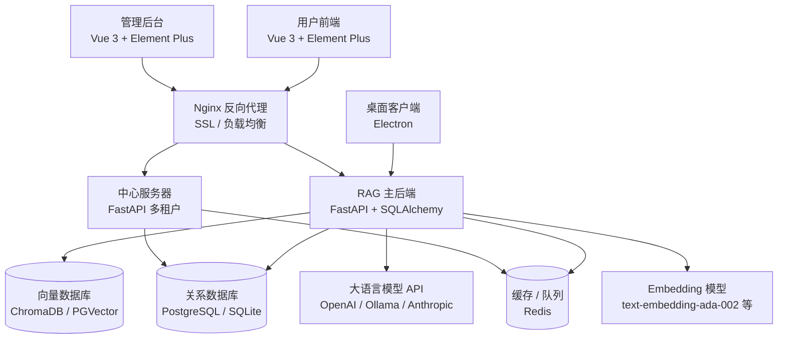

---

## 三、仓库结构（6 大子模块）

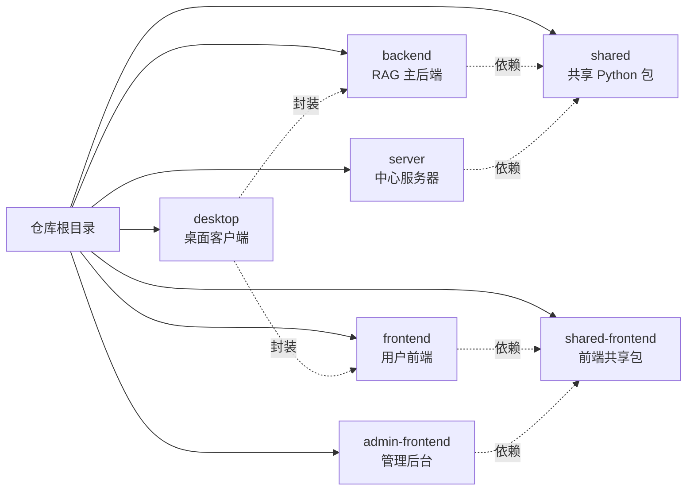

| 子模块 | 技术栈 | 职责 |
|--------|--------|------|
| **backend/** | Python 3.11+, FastAPI, SQLAlchemy Async, Celery | RAG 核心引擎：文档处理、检索、对话、Agent |
| **server/** | Python 3.11+, FastAPI | 多租户中心服务：组织管理、设备注册、技能市场 |
| **shared/** | Python (rag_platform_common) | 共享工具包：密码、JWT、加密、分页 |
| **frontend/** | Vue 3, TypeScript, Vite, Element Plus, Pinia | 用户端 SPA：知识库、对话、模型配置等 |
| **admin-frontend/** | Vue 3, Element Plus | 管理后台：用户管理、组织管理、数据统计 |
| **desktop/** | Electron | 桌面客户端封装，支持本地离线运行 |
| **shared-frontend/** | TypeScript | 前端共享工具：JWT 解析、Axios 拦截器 |

---

## 四、完整技术栈

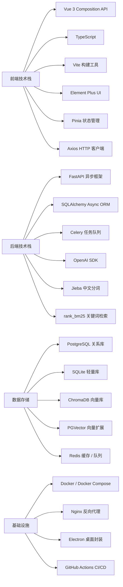

---

## 五、两种部署模式

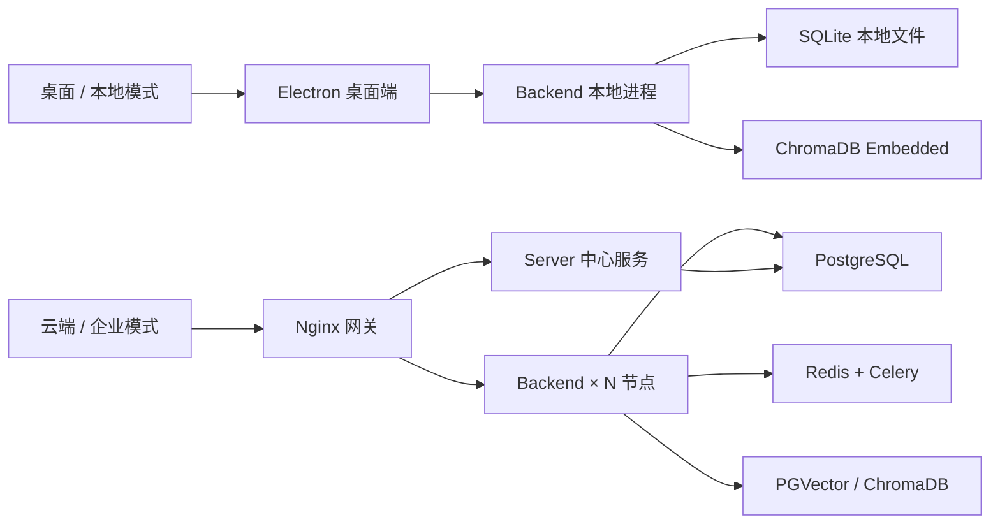

| 对比维度 | 桌面模式 | 云端模式 |
|----------|----------|----------|
| **目标用户** | 个人/小团队 | 企业/多团队 |
| **数据库** | SQLite | PostgreSQL |
| **向量存储** | ChromaDB Embedded | PGVector / ChromaDB Server |
| **缓存** | 内存回退 | Redis |
| **任务队列** | 同步执行 | Celery + Redis |
| **多租户** | 单用户 | 支持组织/工作空间隔离 |
| **网络** | 本地 localhost | Nginx + HTTPS |

---

## 六、核心功能模块

```mermaid
graph TD
    ROOT[知枢 RAG 平台] --> M1[知识管理]
    ROOT --> M2[智能对话]
    ROOT --> M3[高级检索]
    ROOT --> M4[Agent 能力]
    ROOT --> M5[数据源集成]
    ROOT --> M6[企业特性]
    ROOT --> M7[安全机制]

    M1 --> M11[知识库 CRUD]
    M1 --> M12[文档上传与解析]
    M1 --> M13[文本切分策略]
    M1 --> M14[向量化存储]
    M1 --> M15[Web 数据源爬取]

    M2 --> M21[RAG 检索问答]
    M2 --> M22[流式响应]
    M2 --> M23[多轮对话]
    M2 --> M24[对话历史管理]
    M2 --> M25[用户记忆 / 画像]

    M3 --> M31[向量语义检索]
    M3 --> M32[BM25 关键词检索]
    M3 --> M33[混合检索 + RRF 融合]
    M3 --> M34[查询改写 / 多查询扩展]
    M3 --> M35[重排序 Reranking]

    M4 --> M41[单 Agent 工具调用]
    M4 --> M42[多 Agent 协作]
    M4 --> M43[内置工具 8 个]
    M4 --> M44[MCP 服务器协议]
    M4 --> M45[技能脚本扩展]

    M5 --> M51[SQL 数据库对接]
    M5 --> M52[自然语言转 SQL]
    M5 --> M53[Web 爬虫定时同步]
    M5 --> M54[多格式文档解析]

    M6 --> M61[多工作空间]
    M6 --> M62[RBAC 权限控制]
    M6 --> M63[API Key 管理]
    M6 --> M64[多渠道发布]
    M6 --> M65[应用分享]

    M7 --> M71[AES 加密存储]
    M7 --> M72[JWT 认证]
    M7 --> M73[Rate Limiting]
    M7 --> M74[沙箱代码执行]
    M7 --> M75[SSRF 防护]
```

---

## 七、用户使用流程

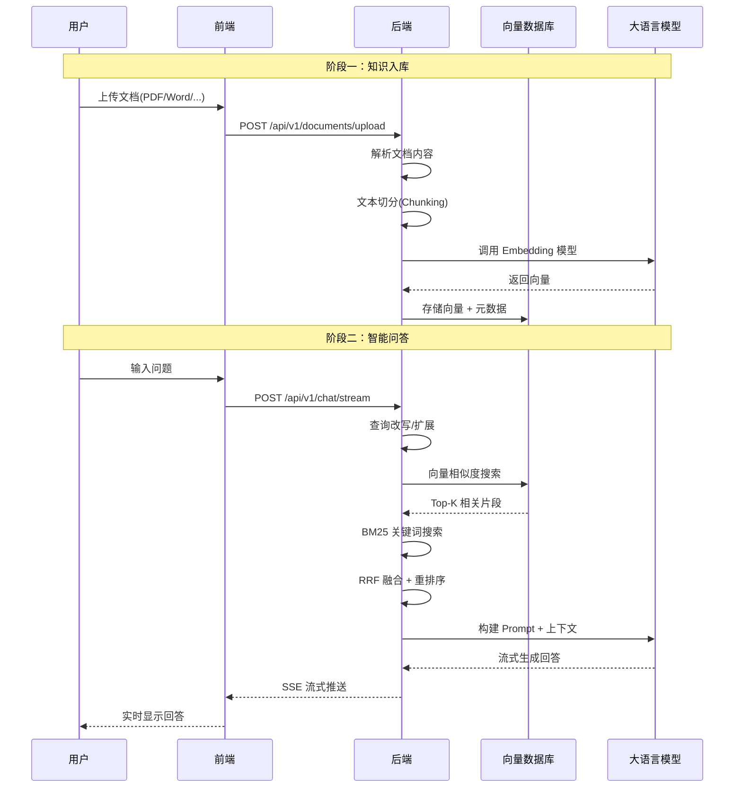

---


---

# 第二章 RAG 核心原理与技术细节

## 一、什么是 RAG？

**RAG（Retrieval-Augmented Generation，检索增强生成）** 是一种将 **信息检索** 与 **大语言模型生成** 相结合的技术范式。

### 传统 LLM 的局限性

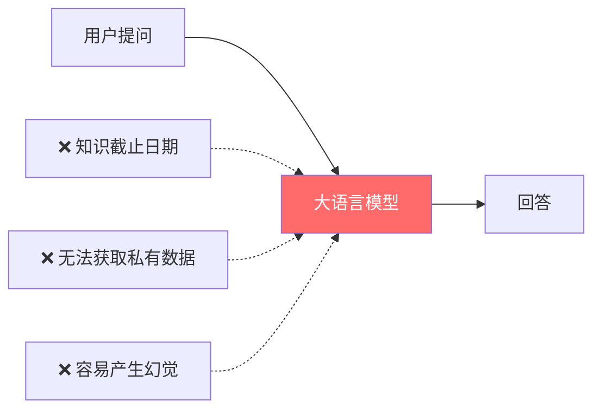

### RAG 的解决方案

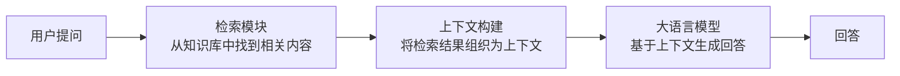

> **核心思想**：不修改模型参数，而是在推理时动态注入外部知识，让 LLM "有据可查" 地回答问题。

---

## 二、RAG 完整流程（本项目实现）

### 2.1 离线阶段：知识入库

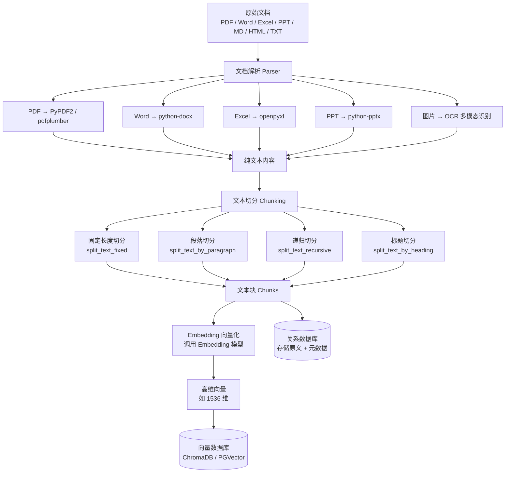

### 2.2 在线阶段：检索问答

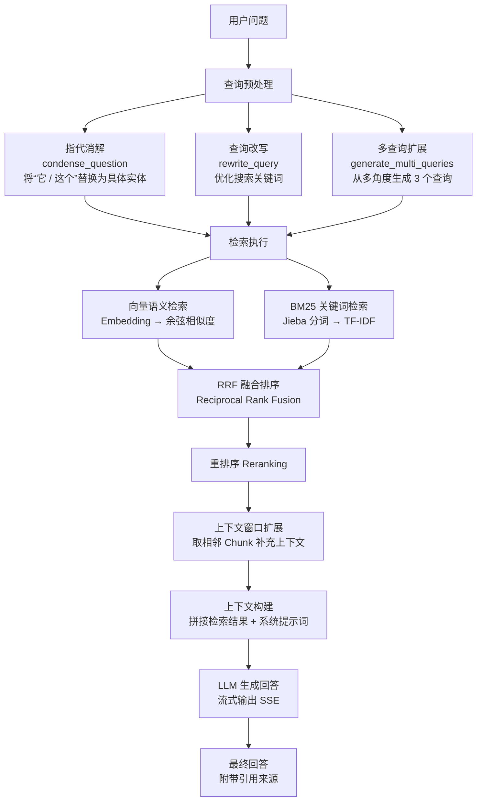

---

## 三、关键技术详解

### 3.1 文本切分（Chunking）

**为什么要切分？** LLM 有上下文长度限制，且过长文本会稀释关键信息。切分后每个 Chunk 包含一个相对独立的语义单元。

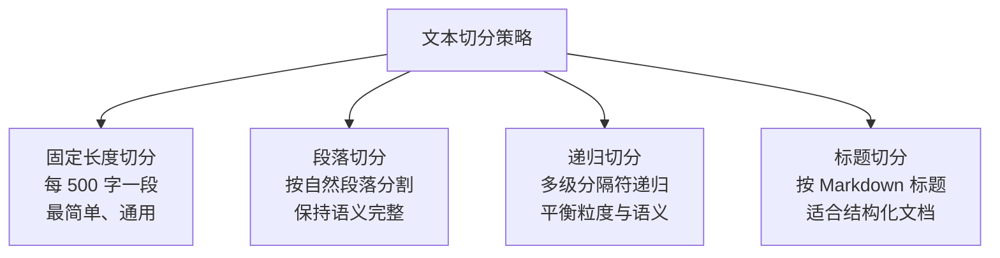

**重叠窗口（Overlap）机制**：
```
Chunk 1: [=============================]
Chunk 2:              [=============================]
Chunk 3:                           [=============================]
                       ↑ 重叠区域 ↑
```
- 默认 chunk_size = 500, overlap = 50
- 重叠确保边界处的信息不会因切分而丢失

### 3.2 Embedding 向量化

**原理**：将文本映射到高维向量空间，语义相似的文本在向量空间中距离更近。

```mermaid
graph LR
    T1[Python 编程语言<br>[0.12, 0.85, ...]]
    T2[Java 开发技术<br>[0.15, 0.82, ...]]
    T3[今天天气很好<br>[0.91, 0.03, ...]]

    T1 -. 语义相似 .-> T2
    T1 -. 语义差异大 .-> T3
```

**本项目支持的 Embedding 模型**：
- **OpenAI**: text-embedding-ada-002 (1536维), text-embedding-3-small/large
- **本地模型**: 通过 Ollama 部署的 Embedding 模型
- **平台内置**: 可配置统一的 Embedding 服务

### 3.3 向量检索（Vector Search）

**余弦相似度**：衡量两个向量方向的一致性

$$
\text{cosine\_similarity}(\vec{A}, \vec{B}) = \frac{\vec{A} \cdot \vec{B}}{|\vec{A}| \times |\vec{B}|}
$$

值域 [-1, 1]，越接近 1 表示越相似。

**本项目的向量存储抽象**：
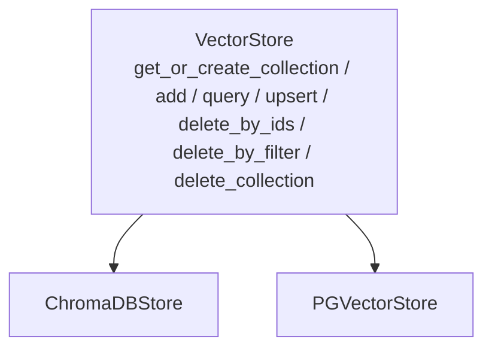

### 3.4 BM25 关键词检索

**BM25（Best Matching 25）** 是经典的基于词频的文本检索算法：

$$
\text{BM25}(q, d) = \sum_{t \in q} \text{IDF}(t) \cdot \frac{f(t,d) \cdot (k_1 + 1)}{f(t,d) + k_1 \cdot (1 - b + b \cdot \frac{|d|}{\text{avgdl}})}
$$

- **IDF(t)**：逆文档频率，衡量词的区分度
- **f(t,d)**：词 t 在文档 d 中的出现频次
- **k₁, b**：调节参数

**本项目实现特点**：
- 使用 **Jieba** 进行中文分词
- BM25 索引有 **LRU 缓存**（TTL=300s，最大 32 个知识库索引）
- CPU 密集计算放入 **线程池** 避免阻塞事件循环

### 3.5 混合检索与 RRF 融合

**为什么需要混合检索？**

| 检索方式 | 优势 | 劣势 |
|----------|------|------|
| **向量检索** | 理解语义，"意思相近"即可匹配 | 对专有名词、编号不敏感 |
| **BM25 关键词** | 精确匹配关键词、编号 | 无法理解同义词、语义 |

**RRF（Reciprocal Rank Fusion）融合算法**：

$$
\text{RRF\_score}(d) = \sum_{r \in R} \frac{w_r}{k + \text{rank}_r(d)}
$$

- k = 60（平滑常数）
- 对每个文档，综合其在各检索列表中的排名
- 排名越靠前，得分越高

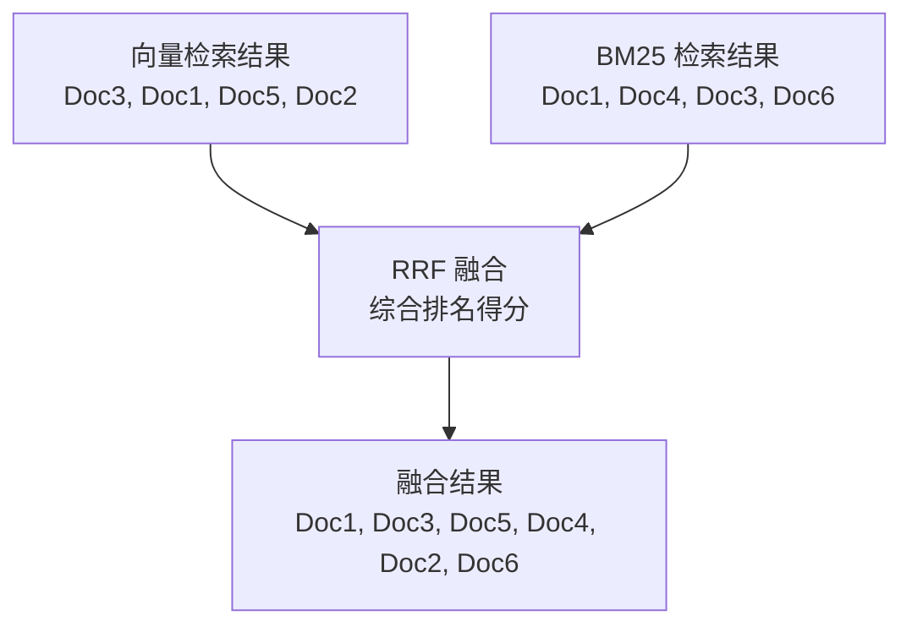

### 3.6 查询改写（Query Rewriting）

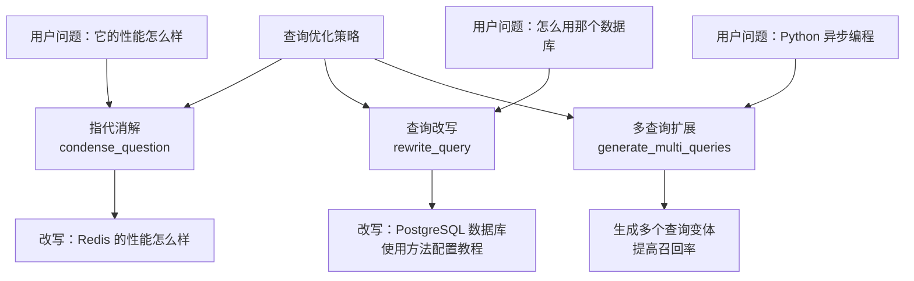

### 3.7 上下文管理引擎

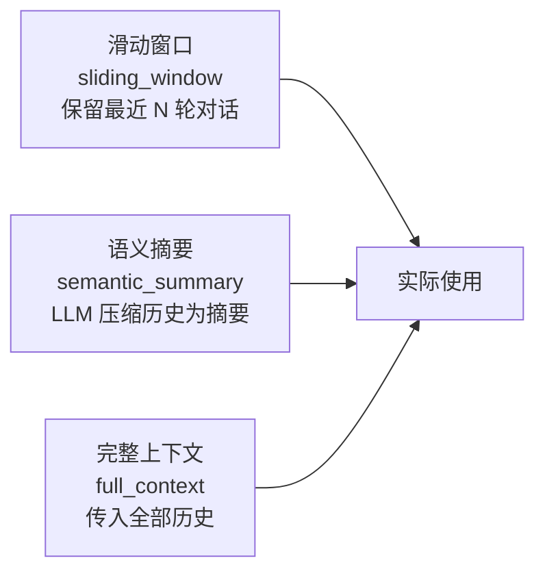

---

## 四、与传统方案的对比

### 4.1 RAG vs 微调（Fine-tuning）

| 对比维度 | RAG | 微调 |
|----------|-----|------|
| **知识更新** | ✅ 实时更新，修改文档即可 | ❌ 需重新训练模型 |
| **成本** | ✅ 低，只需向量化文档 | ❌ 高，需要 GPU 训练 |
| **可溯源** | ✅ 可追溯到原始文档 | ❌ 知识融入参数，不可追溯 |
| **幻觉控制** | ✅ 有上下文约束 | ❌ 仍可能产生幻觉 |
| **专业深度** | ⚠️ 依赖检索质量 | ✅ 深度理解领域知识 |

### 4.2 RAG vs 长上下文模型

| 对比维度 | RAG | 长上下文 (128K+) |
|----------|-----|-------------------|
| **知识库规模** | ✅ 无限制 | ❌ 受窗口限制 |
| **成本** | ✅ 只传相关片段 | ❌ Token 消耗巨大 |
| **精确度** | ✅ 检索聚焦 | ⚠️ 长文本中可能遗漏 |
| **延迟** | ✅ 检索快速 | ❌ 长上下文推理慢 |

---

## 五、本项目的技术创新点

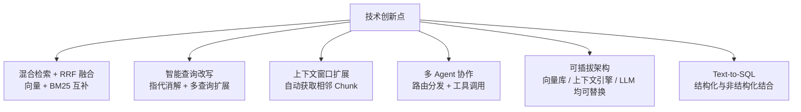

---


---

# 第三章 后端架构详解

## 一、整体分层架构

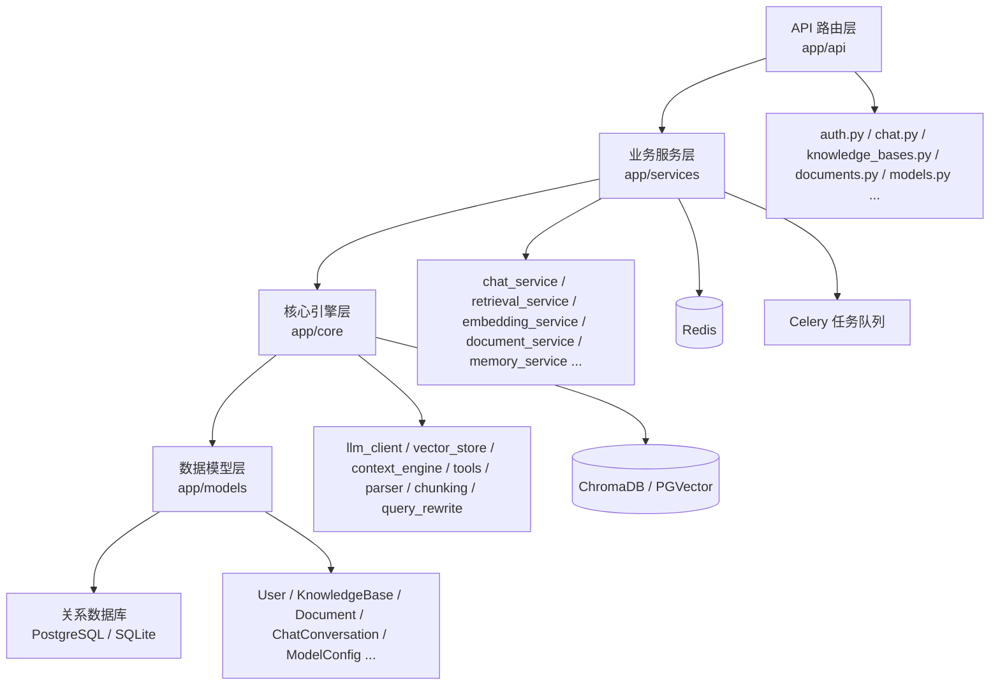

---

## 二、请求处理流程

### 2.1 一次完整的 Chat 请求

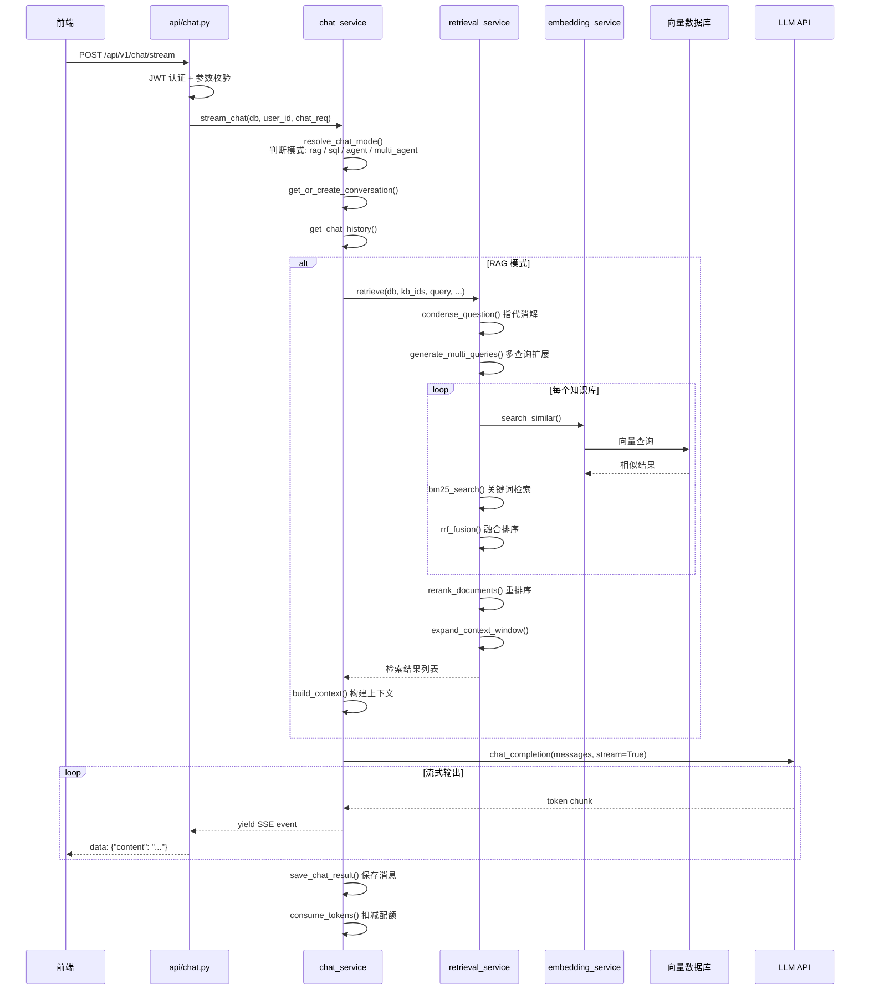

### 2.2 文档处理流程

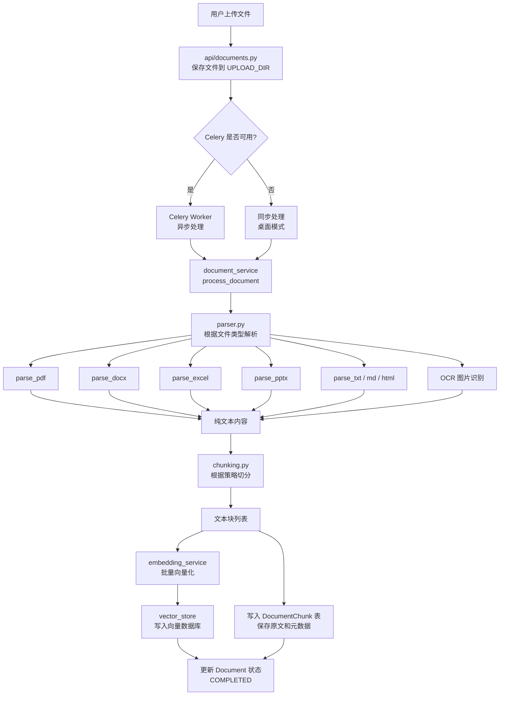

---

## 三、核心服务模块详解

### 3.1 对话服务 (chat_service.py)

```mermaid
graph TD
    CS[chat_service] --> CC[chat_constants.py<br>Prompt 模板和常量]
    CS --> CH[chat_helpers.py<br>错误分类 / 截断 / 上下文构建]
    CS --> CV[chat_conversation.py<br>对话 CRUD 和历史管理]
    CS --> CA[chat_agent.py<br>Agent / 多 Agent / 斜杠命令]

    CS --> RAG[RAG 模式<br>检索 + 生成]
    CS --> SQL[SQL 模式<br>Text-to-SQL]
    CS --> AGT[Agent 模式<br>Function Calling]
    CS --> MAG[多 Agent 模式<br>路由 + 汇总]
    CS --> HYB[混合模式<br>RAG + SQL]
```

**五种对话模式**：

| 模式 | 触发条件 | 流程 |
|------|----------|------|
| **RAG** | 关联知识库 | 检索知识库 → 构建上下文 → LLM 生成 |
| **SQL** | 关联数据库源 | 自然语言 → SQL → 执行 → 解读结果 |
| **Agent** | 启用 Agent 模式 | LLM 决定调用工具 → 执行 → 返回 |
| **Multi-Agent** | 配置多 Agent | 路由分发子问题 → 各 Agent 处理 → 汇总 |
| **Hybrid** | 同时关联 KB + DB | RAG + SQL 并行检索 → 融合生成 |

### 3.2 检索服务 (retrieval_service.py)

```mermaid
flowchart LR
    Q[用户查询] --> CD[condense_question<br>指代消解]
    KB[知识库列表] --> MQ[generate_multi_queries<br>多查询扩展]
    CD --> MQ
    MQ --> VS[向量检索<br>search_similar]
    MQ --> BM[BM25 检索<br>bm25_search]
    VS --> RRF[RRF 融合<br>rrf_fusion]
    BM --> RRF
    RRF --> FT[过滤失效文档<br>filter_results]
    FT --> RK[重排序<br>rerank_documents]
    RK --> EX[上下文扩展<br>expand_context_window]
```

### 3.3 Agent 工具框架 (core/tools/)

```mermaid
graph TD
    REG[ToolRegistry<br>register / get_tool / list_tools / to_openai_functions] --> BASE[BaseTool<br>name / description / parameters / execute]
    BASE --> RES[ToolResult<br>success / data / error]

    BASE --> T1[KnowledgeSearchTool]
    BASE --> T2[SQLQueryTool]
    BASE --> T3[CalculatorTool]
    BASE --> T4[CurrentTimeTool]
    BASE --> T5[WebSearchTool]
    BASE --> T6[AgentQueryTool]
    BASE --> T7[BrowserTool]
    BASE --> T8[CodeExecutorTool]
```

**8 个内置工具**：

| 工具名 | 功能 | 使用场景 |
|--------|------|----------|
| **knowledge_search** | 搜索知识库 | 回答需要查阅文档的问题 |
| **sql_query** | 执行 SQL 查询 | 查询结构化数据 |
| **calculator** | 数学计算 | 精确数值计算 |
| **current_time** | 获取当前时间 | 时间相关问题 |
| **web_search** | 网络搜索 | 查找实时信息 |
| **agent_query** | 调用其他 Agent | 多 Agent 协作中的子任务分发 |
| **browser_tool** | 网页内容提取 | 读取指定 URL 内容 |
| **code_executor** | 沙箱执行代码 | 运行 Python 代码 |

---

## 四、LLM 调用统一层 (llm_client.py)

```mermaid
graph TD
    CC[chat_completion<br>对话生成] --> BP[_build_client<br>连接池管理]
    EM[get_embedding<br>文本向量化] --> BP
    RR[rerank_documents<br>结果重排] --> BP

    BP --> PP[_CLIENT_POOL<br>复用 AsyncOpenAI<br>最大 16 个客户端]
    PP --> OA[OpenAI<br>GPT-4 / 3.5]
    PP --> OL[Ollama<br>本地模型]
    PP --> AN[Anthropic<br>Claude]
    PP --> CT[其他 OpenAI 兼容 API]
```

**关键设计**：
- **连接池复用**：按 (base_url, api_key_hash) 缓存客户端，避免重复创建连接
- **API Key 加密存储**：数据库中存密文，调用时解密
- **统一接口**：所有 LLM 通过 OpenAI SDK 的兼容协议调用

---

## 五、安全机制

```mermaid
graph TD
    ROOT[安全机制] --> JWT[JWT Token<br>Access + Refresh]
    ROOT --> RBAC[RBAC 权限<br>admin / user / viewer]
    ROOT --> WS[工作空间隔离<br>多租户数据隔离]
    ROOT --> ENC[AES-256 加密<br>API Key 密文存储]
    ROOT --> HKDF[HKDF 密钥派生<br>SECRET_KEY → 加密密钥]
    ROOT --> HASH[API Key 哈希<br>bcrypt 不可逆存储]
    ROOT --> RL[Rate Limiting<br>Redis / 内存限流]
    ROOT --> SSRF[SSRF 防护<br>URL 白名单校验]
    ROOT --> SB[沙箱执行<br>Docker 隔离代码]
    ROOT --> SQL_INJ[SQL 注入防护<br>关键词黑名单]
    ROOT --> HTTPS[HTTPS<br>TLS 加密传输]
    ROOT --> CSP[CSP 头<br>内容安全策略]
    ROOT --> CORS[CORS 锁定<br>跨域白名单]
```

---

## 六、应用启动流程

```mermaid
flowchart TD
    A[main.py<br>入口文件] --> B[bootstrap.py<br>初始化引导]

    B --> B1[检查 / 生成 SECRET_KEY]
    B --> B2[初始化数据库连接]
    B --> B3[自动建表 create_all]
    B --> B4[初始化向量存储]
    B --> B5[种子数据 model_seed]
    B --> B6[启动定时任务调度器]

    B --> C[http_setup.py<br>HTTP 中间件]
    C --> C1[RequestIDMiddleware<br>请求追踪]
    C --> C2[CORS 中间件]
    C --> C3[Rate Limit 中间件]
    C --> C4[安全响应头]

    B --> D[app_routes.py<br>路由注册]
    D --> D1[挂载 24 个 API Router]
    D --> D2[静态文件服务]
    D --> D3[健康检查端点]

    B1 --> E[FastAPI 应用就绪]
    B2 --> E
    B3 --> E
    B4 --> E
    B5 --> E
    B6 --> E
    C1 --> E
    C2 --> E
    C3 --> E
    C4 --> E
    D1 --> E
    D2 --> E
    D3 --> E

    E --> F[Uvicorn 启动<br>监听端口]
```

---


---

# 第四章 前端架构详解

## 一、技术栈概览

```mermaid
graph LR
    FE[前端技术栈] --> VUE[Vue 3<br>Composition API]
    FE --> TS[TypeScript<br>类型安全]
    FE --> VITE[Vite<br>极速构建]
    FE --> EP[Element Plus<br>UI 组件库]
    FE --> PN[Pinia<br>状态管理]
    FE --> VR[Vue Router<br>路由管理]
    FE --> AX[Axios<br>HTTP 请求]
    FE --> NP[NProgress<br>页面加载进度条]
```

---

## 二、项目结构

```
frontend/src/
├── App.vue                 # 根组件
├── main.ts                 # 入口文件（挂载 Vue 实例）
├── router/index.ts         # 路由配置 + 导航守卫
├── stores/                 # Pinia 状态管理
│   └── user.ts             # 用户认证状态
├── api/                    # 后端 API 封装（16 个模块）
│   ├── auth.ts             # 认证 API
│   ├── chat.ts             # 对话 API
│   ├── knowledge.ts        # 知识库 API
│   ├── documents.ts        # 文档 API
│   ├── models.ts           # 模型 API
│   └── ...
├── components/             # 公共组件
│   ├── layout/             # 布局组件（顶栏、侧栏）
│   └── chat/               # 对话相关组件
├── views/                  # 页面视图（30 个）
│   ├── login/              # 登录页
│   ├── knowledge/          # 知识库管理
│   ├── documents/          # 文档管理
│   ├── chat/               # 智能对话（核心页面）
│   ├── retrieval/          # 检索测试
│   ├── models/             # 模型管理
│   ├── apps/               # 应用发布
│   ├── agents/             # 多 Agent 协作
│   └── ...
├── utils/                  # 工具函数
│   ├── jwt.ts              # JWT 解析
│   ├── apiBase.ts          # API 基础 URL
│   └── request.ts          # Axios 封装
└── styles/                 # 全局样式
```

---

## 三、路由设计

```mermaid
graph TD
    ROOT["/"] --> LAYOUT[Layout 布局组件<br>侧栏 + 顶栏 + 内容区]
    
    LAYOUT --> K[/knowledge<br>知识库管理]
    LAYOUT --> D[/knowledge/:id/documents<br>文档管理]
    LAYOUT --> CH[/chat<br>智能对话核心]
    LAYOUT --> RT[/retrieval<br>检索测试]
    LAYOUT --> MD[/models<br>模型管理]
    LAYOUT --> DB[/databases<br>数据库管理]
    LAYOUT --> AP[/apps<br>应用发布]
    LAYOUT --> CN[/channels<br>渠道管理]
    LAYOUT --> SK[/skills<br>技能市场]
    LAYOUT --> AT[/automations<br>自动化任务]
    LAYOUT --> AG[/agents<br>多 Agent 协作]
    LAYOUT --> MC[/mcp<br>MCP 服务器]
    LAYOUT --> DG[/diagnostics<br>系统诊断]
    LAYOUT --> WK[/workspaces<br>工作空间]
    LAYOUT --> SY[/system<br>系统管理 Admin]
    LAYOUT --> ST[/settings<br>个人设置]
    LAYOUT --> AU[/admin/users<br>用户管理 Admin]
    
    LOGIN[/login<br>登录页] -.公开路由.-> ROOT
    SHARE[/share/:token<br>分享问答] -.公开路由.-> ROOT
    INVITE[/invite/:token<br>加入工作空间] -.公开路由.-> ROOT
```

### 路由守卫机制

```mermaid
flowchart TD
    A[用户访问页面] --> B{是公开路由?}
    B -->|是| C[直接放行]
    B -->|否| D{有 Token?}
    D -->|否| E[跳转登录页]
    D -->|是| F{Token 过期?}
    F -->|否| G{已获取用户信息?}
    F -->|是| H{有 RefreshToken?}
    H -->|否| E
    H -->|是| I[调用 /auth/refresh<br>刷新 Token]
    I -->|成功| G
    I -->|失败| E
    G -->|否| J[调用 fetchUserInfo]
    G -->|是| K{需要管理员权限?}
    J -->|成功| K
    J -->|网络错误| L[保留 Token 放行<br>避免误踢]
    J -->|认证失败| E
    K -->|是| M{角色满足?}
    K -->|否| N[放行进入页面]
    M -->|是| N
    M -->|否| O[重定向首页]
    
    style E fill:#ff6b6b,color:#fff
    style N fill:#51cf66,color:#fff
```

---

## 四、状态管理（Pinia）

```mermaid
graph TD
    STORE[UserStore] --> STATE[状态 State]
    STORE --> ACTIONS[动作 Actions]
    STORE --> GETTERS[计算属性 Getters]

    STATE --> S1[token]
    STATE --> S2[refreshToken]
    STATE --> S3[userInfo]

    ACTIONS --> A1[setToken]
    ACTIONS --> A2[clearToken]
    ACTIONS --> A3[fetchUserInfo]
    ACTIONS --> A4[setRefreshToken]

    GETTERS --> G1[isLoggedIn]
    GETTERS --> G2[isAdmin]

    LS[(localStorage)] -.持久化.-> STATE
```

---

## 五、核心页面 — 智能对话

```mermaid
graph TD
    SIDEBAR[ChatConversationSidebar<br>对话列表侧栏<br>历史会话管理] --> MAIN[对话主区域<br>消息展示 + 输入框]
    CONFIG[ChatConfigBar<br>对话配置栏<br>选择知识库 / 模型 / 模式] --> MAIN
    MAIN --> STREAM[Server-Sent Events<br>实时显示 AI 回复]
```

### 流式对话的前端实现

```mermaid
sequenceDiagram
    participant User as 用户
    participant Chat as 对话页面
    participant API as Axios/Fetch
    participant BE as 后端

    User->>Chat: 输入问题，点击发送
    Chat->>Chat: 添加用户消息到列表
    Chat->>Chat: 创建空的 AI 消息占位
    Chat->>API: POST /api/v1/chat/stream<br>(EventSource / fetch stream)
    API->>BE: HTTP 请求
    
    loop SSE 事件流
        BE-->>API: data: {"content": "你"}
        API-->>Chat: 追加文本
        Chat-->>User: 实时显示 "你"
        
        BE-->>API: data: {"content": "好"}
        API-->>Chat: 追加文本
        Chat-->>User: 实时显示 "你好"
        
        BE-->>API: data: {"content": "！"}
        API-->>Chat: 追加文本
        Chat-->>User: 实时显示 "你好！"
    end
    
    BE-->>API: data: [DONE]
    Chat->>Chat: 标记消息完成
```

---

## 六、API 封装层

```mermaid
graph LR
    A1[auth.ts<br>登录 / 注册 / 刷新] --> REQ[utils/request.ts<br>Axios 实例<br>统一拦截器]
    A2[chat.ts<br>对话 / 历史 / 流式] --> REQ
    A3[knowledge.ts<br>知识库 CRUD] --> REQ
    A4[documents.ts<br>文档上传 / 管理] --> REQ
    A5[models.ts<br>模型配置] --> REQ
    A6[apps.ts / channels.ts / databases.ts / workspaces.ts / skills.ts / agents.ts] --> REQ
    REQ --> BASE[utils/apiBase.ts<br>API_V1 基础路径]
    BASE --> BE[后端 API /api/v1]
```

**Axios 拦截器功能**：
- **请求拦截**：自动附加 JWT Token 到 Authorization 头
- **响应拦截**：401 时自动尝试 Token 刷新，失败则跳转登录

---

## 七、前端共享包 (shared-frontend/)

```mermaid
graph TD
    PKG[shared-frontend 包] --> JWT[jwt.ts<br>JWT 解码 / 过期检测]
    PKG --> REQ[request.ts<br>Axios 拦截器抽象]
    PKG --> PERM[permissions<br>角色 / 权限枚举]
    FE[frontend] -.npm link.-> PKG
    AF[admin-frontend] -.npm link.-> PKG
```

---


---

# 第五章 数据库设计

## 一、数据库选型

| 场景 | 数据库 | 用途 |
|------|--------|------|
| **桌面/本地模式** | SQLite | 轻量级，零配置，单文件存储 |
| **云端/企业模式** | PostgreSQL | 高并发，支持事务，企业级可靠性 |
| **向量存储（本地）** | ChromaDB Embedded | 嵌入式运行，无需单独部署 |
| **向量存储（生产）** | PGVector | PostgreSQL 扩展，统一运维 |
| **缓存/队列** | Redis | Token 黑名单、限流、Celery 消息队列 |

> 关系数据库使用 **SQLAlchemy Async ORM**，通过异步引擎（`aiosqlite` / `asyncpg`）实现非阻塞数据库操作。

---

## 二、核心 ER 图

```mermaid
erDiagram
    User ||--o{ ModelConfig : "拥有"
    User ||--o{ KnowledgeBase : "创建"
    User ||--o{ ChatConversation : "发起"
    User ||--o{ Workspace : "创建(owner)"
    User ||--o{ WorkspaceMember : "加入"
    User ||--o{ ApiKey : "持有"
    User ||--o| UserProfile : "画像"
    User ||--o{ UserMemory : "记忆"
    User ||--o| UserQuota : "配额"

    KnowledgeBase ||--o{ Document : "包含"
    KnowledgeBase ||--o{ DocumentChunk : "索引"
    KnowledgeBase ||--o{ ChatConversation : "关联"
    KnowledgeBase ||--o{ DatabaseSource : "对接"
    KnowledgeBase }o--|| ModelConfig : "embedding模型"

    Document ||--o{ DocumentChunk : "切分为"

    ChatConversation ||--o{ ChatMessage : "包含"
    ChatConversation }o--|| ModelConfig : "使用模型"

    Workspace ||--o{ WorkspaceMember : "成员"
    Workspace ||--o{ WorkspaceKnowledgeBase : "共享知识库"
    Workspace ||--o{ WorkspaceModelConfig : "共享模型"
    Workspace ||--o{ WorkspaceInvitation : "邀请链接"

    WorkspaceKnowledgeBase }o--|| KnowledgeBase : "关联"
    WorkspaceModelConfig }o--|| ModelConfig : "关联"

    KnowledgeBase ||--o{ WebSource : "网页数据源"
    KnowledgeBase ||--o{ Channel : "发布渠道"

    User ||--o{ Skill : "创建"
    Skill ||--o{ SkillInstall : "安装记录"
    User ||--o{ SkillChain : "编排"
    User ||--o{ AutomationTask : "自动化"
    User ||--o{ AgentConfig : "Agent配置"
```

---

## 三、核心表结构详解

### 3.1 用户体系

```mermaid
graph TD
    U[User<br>id / username / email / hashed_password / role / is_active / created_at]
    UP[UserProfile<br>id / user_id / profile_data / updated_at]
    UM[UserMemory<br>id / user_id / memory_type / content / importance / created_at]
    UQ[UserQuota<br>id / user_id / total_tokens / used_tokens / plan_type / expires_at]
    AK[ApiKey<br>id / user_id / name / key_hash / key_prefix / last_used_at / expires_at]

    U --> UP
    U --> UM
    U --> UQ
    U --> AK
```

### 3.2 知识管理核心

```mermaid
graph TD
    KB[KnowledgeBase<br>id / user_id / name / embedding_model_id / doc_count / chunk_count / search_mode]
    DOC[Document<br>id / kb_id / filename / file_type / chunk_count / status / content_hash]
    CHUNK[DocumentChunk<br>id / doc_id / kb_id / content / chunk_index / metadata / created_at]

    KB --> DOC
    DOC --> CHUNK
    KB --> CHUNK
```

> **注意**：`DocumentChunk` 同时冗余了 `kb_id`，便于检索时直接按知识库过滤，避免 JOIN。

### 3.3 对话系统

```mermaid
graph TD
    CONV[ChatConversation<br>id / user_id / kb_id / title / llm_model_id / total_input_tokens / total_output_tokens / context_summary]
    MSG[ChatMessage<br>id / conversation_id / role / content / references / token_count / feedback / latency_ms / msg_type]

    CONV --> MSG
```

**设计要点**：
- `total_input/output_tokens`：追踪每个对话的 Token 消耗量
- `context_summary`：语义摘要引擎的缓存，避免重复压缩
- `latency_ms`：记录每条回复延迟，用于性能监控
- `msg_type = compaction`：标记被压缩合并的历史消息

### 3.4 模型配置

```mermaid
graph TD
    MC[ModelConfig<br>id / user_id / model_type / provider / api_base / api_key_encrypted / model_name / display_name / params / is_default]
```

**安全设计**：API Key 使用 AES-256 加密存储（`api_key_encrypted`），调用时解密。

### 3.5 工作空间（多租户）

```mermaid
graph TD
    W[Workspace<br>id / name / description / owner_id / created_at]
    WM[WorkspaceMember<br>id / workspace_id / user_id / role / joined_at]
    WKB[WorkspaceKnowledgeBase<br>id / workspace_id / kb_id / created_at]
    WMC[WorkspaceModelConfig<br>id / workspace_id / model_config_id / shared_by / created_at]
    WI[WorkspaceInvitation<br>id / workspace_id / invite_token / role / max_uses / use_count / is_active / expires_at]

    W --> WM
    W --> WKB
    W --> WMC
    W --> WI
```

**多租户隔离模型**：
- 不采用 schema-per-tenant，而是通过 **关联表** 实现资源共享
- 一个知识库只能属于一个工作空间（`kb_id` 有 UK 约束）
- 成员角色四级：Owner > Admin > Member > Viewer

---

## 四、完整数据模型总览（26 张表）

```mermaid
graph TD
    ROOT[完整数据模型] --> U[用户体系<br>users / user_profiles / user_memories / user_quotas / usage_logs / api_keys]
    ROOT --> KB[知识管理<br>knowledge_bases / documents / document_chunks / database_sources / database_sync_runs / web_sources]
    ROOT --> CC[对话系统<br>chat_conversations / chat_messages]
    ROOT --> MC[模型配置<br>model_configs / prompt_templates]
    ROOT --> W[工作空间<br>workspaces / workspace_members / workspace_knowledge_bases / workspace_model_configs / workspace_invitations]
    ROOT --> EXT[扩展功能<br>channels / channel_sessions / channel_schedules / skills / skill_installs / skill_chains / automation_tasks / automation_logs / agent_configs / mcp_server_configs / operation_logs / devices / published_apps]

    U --> KB
    U --> CC
    U --> MC
    U --> W
    KB --> CC
```

---

## 五、关键索引设计

| 表 | 索引 | 用途 |
|----|------|------|
| `users` | `ix_username`, `ix_email` | 登录查找 |
| `documents` | `ix_documents_kb_status` (kb_id, status) | 按知识库+状态筛选文档 |
| `document_chunks` | `ix_chunks_kb_doc` (kb_id, doc_id) | 检索时按知识库快速查找切片 |
| `chat_conversations` | `ix_conv_user_created` (user_id, created_at) | 用户对话列表排序 |
| `workspace_members` | `uq_workspace_member` (workspace_id, user_id) | 防止重复加入 |

---

## 六、数据流向图

```mermaid
flowchart LR
    UPLOAD[文档上传] --> DOC2[(documents)]
    DOC2 --> CHUNK[(document_chunks)]
    CHUNK --> VDB[(向量数据库)]

    QUERY[用户提问] --> VDB
    VDB --> RESULTS[检索结果]
    QUERY --> CHUNK
    CHUNK --> RESULTS
    RESULTS --> LLM[LLM 生成]
    LLM --> MSG[(chat_messages)]

    ADMIN[管理操作] --> USERS[(users)]
    ADMIN --> WS3[(workspaces)]
    ADMIN --> MODELS[(model_configs)]
```

---


---

# 第六章 答辩要点速查

> 本文档整理了答辩中最可能被问到的问题及参考回答，帮助你快速准备。

---

## 一、项目概述类问题

### Q1: 请简要介绍一下你的项目

> **知枢**是一个基于 RAG（检索增强生成）技术的企业智能知识平台。用户可以上传各种格式的文档（PDF、Word、Excel 等），系统自动解析、切分、向量化存储，然后通过智能对话界面，利用大语言模型结合知识库内容，实现精准的问答服务。
>
> 系统采用 **前后端分离** 架构：
> - **后端**：Python FastAPI 异步框架 + SQLAlchemy ORM
> - **前端**：Vue 3 + TypeScript + Element Plus
> - **数据存储**：PostgreSQL（关系数据）+ ChromaDB/PGVector（向量数据）+ Redis（缓存队列）
>
> 支持**桌面本地部署**和**云端企业部署**两种模式。

### Q2: 你的项目解决了什么问题？

> 传统大语言模型（如 ChatGPT）存在三个核心问题：
> 1. **知识截止**：无法获取训练数据之后的信息
> 2. **私有数据盲区**：无法访问企业内部文档
> 3. **幻觉问题**：可能编造不存在的事实
>
> 本项目通过 RAG 技术，在用户提问时**实时检索**企业知识库中的相关内容，将其作为上下文注入 LLM，使回答**有据可查、准确可靠**。

### Q3: 你的项目有哪些核心功能？

> 1. **多格式文档管理**：支持 PDF/Word/Excel/PPT/MD/HTML/TXT/图片(OCR)
> 2. **混合检索引擎**：向量语义检索 + BM25 关键词检索 + RRF 融合
> 3. **智能对话**：流式回答、多轮对话、引用溯源
> 4. **多种对话模式**：RAG问答、自然语言转SQL、Agent工具调用、多Agent协作
> 5. **企业特性**：多工作空间、RBAC权限、API Key管理、多渠道发布
> 6. **安全机制**：AES加密存储、JWT认证、沙箱代码执行、SSRF防护

---

## 二、技术原理类问题

### Q4: 什么是 RAG？为什么选择 RAG 而不是微调？

> **RAG（Retrieval-Augmented Generation）** 即检索增强生成，核心思想是在 LLM 推理时动态注入外部知识。
>
> **流程**：用户提问 → 从知识库检索相关内容 → 将检索结果作为上下文与问题一起发送给 LLM → LLM 基于上下文生成回答。
>
> **选择 RAG 而非微调的原因**：
>
> | 维度 | RAG | 微调 |
> |------|-----|------|
> | 知识更新 | ✅ 修改文档即时生效 | ❌ 需重新训练 |
> | 成本 | ✅ 低，无需 GPU | ❌ 高，需要算力 |
> | 可溯源 | ✅ 可追溯到原文 | ❌ 不可追溯 |
> | 幻觉控制 | ✅ 有上下文约束 | ❌ 仍有幻觉风险 |

### Q5: Embedding 是什么？向量检索的原理？

> **Embedding** 是将文本映射到高维向量空间的过程。语义相似的文本，在向量空间中的距离更近。
>
> **原理**：
> 1. 将知识库中的每个文本块通过 Embedding 模型转换为向量（如 1536 维）
> 2. 用户提问也转换为同维度的向量
> 3. 计算**余弦相似度**，找到最相近的 Top-K 个文本块
>
> **余弦相似度公式**：cos(A,B) = (A·B) / (|A|×|B|)，值越接近 1 越相似。

### Q6: 为什么要做混合检索？什么是 RRF？

> **混合检索的必要性**：
> - **向量检索**擅长理解语义（如"汽车"能匹配"轿车"），但对专有名词、编号不敏感
> - **BM25 关键词检索**擅长精确匹配关键词，但无法理解同义词
>
> 两者互补，混合使用能显著提升检索质量。
>
> **RRF（Reciprocal Rank Fusion）** 是一种融合排序算法：
> - 公式：`RRF_score(d) = Σ w/(k + rank(d))`，k=60
> - 对每个文档，综合其在向量检索和BM25检索中的排名
> - 排名越靠前（rank越小），得分越高
> - 最终按融合得分重新排序

### Q7: 文本切分（Chunking）为什么重要？你用了什么策略？

> **重要性**：LLM 有上下文长度限制（如 4K/8K/128K tokens），且过长文本会稀释关键信息。切分后每个 Chunk 是一个相对独立的语义单元，能提高检索精度。
>
> **本项目实现了四种策略**：
> 1. **固定长度切分**：每 500 字一段，最通用
> 2. **段落切分**：按自然段落分割，保持语义完整
> 3. **递归切分**：多级分隔符（标题→段落→句子）递归分割
> 4. **标题切分**：按 Markdown 标题分割，适合结构化文档
>
> 所有策略都支持**重叠窗口**（默认 50 字），确保切分边界不丢失信息。

### Q8: 查询改写是怎么实现的？

> 本项目实现了三种查询优化策略：
>
> 1. **指代消解**（condense_question）：
>    - 场景：用户说"它的性能怎么样？"，历史中讨论了 Redis
>    - 改写为："Redis 的性能怎么样？"
>
> 2. **查询改写**（rewrite_query）：
>    - 去除口语化表达，提取核心关键词
>    - "怎么用那个数据库？" → "PostgreSQL 数据库使用方法配置教程"
>
> 3. **多查询扩展**（generate_multi_queries）：
>    - 从不同角度生成 3 个查询，提升召回率
>    - "Python 异步编程" → ["Python asyncio", "Python async await 协程", "Python 异步IO并发"]
>
> 这些改写都是通过调用 LLM 完成的（利用 Prompt Engineering）。

---

## 三、架构设计类问题

### Q9: 你的后端架构是怎么分层的？

> 采用经典的**四层架构**：
>
> 1. **API 路由层**（`app/api/`，24个模块）：接收HTTP请求，参数校验，调用服务层
> 2. **业务服务层**（`app/services/`，22个模块）：核心业务逻辑编排
> 3. **核心引擎层**（`app/core/`）：LLM调用、向量存储、文档解析、查询改写等底层能力
> 4. **数据模型层**（`app/models/`，26个ORM模型）：数据库表映射
>
> **设计原则**：上层依赖下层，下层不依赖上层；核心引擎层提供可插拔的抽象接口。

### Q10: 为什么选择 FastAPI？

> 1. **异步支持**：原生 async/await，适合 IO 密集型场景（LLM API 调用、数据库查询）
> 2. **高性能**：基于 Starlette，性能接近 Go/Node.js
> 3. **自动文档**：基于 Pydantic 自动生成 OpenAPI 文档
> 4. **类型安全**：Python 类型注解 + Pydantic 模型验证
> 5. **生态丰富**：与 SQLAlchemy、Celery 等成熟库良好集成

### Q11: 前端为什么选择 Vue 3 + TypeScript？

> 1. **Vue 3 Composition API**：更灵活的代码组织，逻辑复用更方便
> 2. **TypeScript**：编译时类型检查，减少运行时错误
> 3. **Vite**：极速的开发服务器和构建工具（比 Webpack 快 10-100 倍）
> 4. **Element Plus**：成熟的企业级 UI 组件库，开发效率高
> 5. **Pinia**：Vue 3 官方推荐的状态管理库，比 Vuex 更简洁

### Q12: 流式对话是怎么实现的？

> 使用 **Server-Sent Events (SSE)** 技术：
>
> 1. 前端发起 HTTP POST 请求到 `/api/v1/chat/stream`
> 2. 后端调用 LLM API 时开启流式模式（`stream=True`）
> 3. LLM 每生成一个 token 就通过 SSE 推送给前端
> 4. 前端实时追加显示文本，实现"打字机"效果
> 5. 直到收到 `[DONE]` 信号表示生成完成
>
> 后端使用 FastAPI 的 `StreamingResponse` + Python `AsyncGenerator` 实现。

### Q13: 你的向量存储是怎么抽象的？

> 定义了统一的 `VectorStore` 抽象基类（Abstract Base Class），包含 7 个抽象方法：
> - `add()` — 添加向量
> - `query()` — 相似度查询
> - `upsert()` — 插入或更新
> - `delete_by_ids()` / `delete_by_filter()` — 删除
> - `get_or_create_collection()` / `delete_collection()` — 集合管理
>
> 两个实现类：`ChromaDBStore`（本地）和 `PGVectorStore`（生产），通过工厂函数 `get_vector_store()` 根据配置自动选择。
>
> 这种设计遵循了**依赖倒置原则**和**策略模式**。

---

## 四、安全与部署类问题

### Q14: 你做了哪些安全措施？

> **认证层**：
> - JWT Token（Access + Refresh 双令牌机制）
> - 2FA 两步验证（TOTP）
> - Token 黑名单（Redis存储，登出即失效）
>
> **数据层**：
> - API Key 使用 AES-256-CBC 加密存储
> - HKDF 密钥派生（SECRET_KEY → 加密密钥）
> - 密码使用 bcrypt 哈希，不可逆
>
> **运行时**：
> - Rate Limiting 限流（Redis/内存回退）
> - SSRF 防护（URL 白名单校验）
> - SQL 注入防护（关键词黑名单 + ORM 参数化）
> - 代码执行沙箱（Docker 隔离）
>
> **传输层**：
> - HTTPS（Nginx TLS 终止）
> - CSP / CORS / 安全响应头

### Q15: 项目如何部署？

> **两种部署模式**：
>
> 1. **桌面模式**：Electron 封装，SQLite + ChromaDB Embedded，零配置启动
> 2. **云端模式**：Docker Compose 编排，PostgreSQL + Redis + Celery + Nginx
>
> 云端部署架构：
> - Nginx 做反向代理和 HTTPS 终止
> - Backend 可水平扩展多实例
> - Celery Worker 异步处理文档解析
> - Redis 提供缓存、消息队列、限流

---

## 五、创新与亮点类问题

### Q16: 你的项目相比开源方案（如 LangChain、Dify）有什么特点？

> 1. **混合检索 + RRF 融合**：不仅做向量检索，还结合 BM25 关键词检索，融合排序提升召回率
> 2. **多模式对话**：支持 RAG、SQL查询、Agent工具调用、多Agent协作等多种模式
> 3. **完整的企业特性**：多工作空间隔离、RBAC 权限、多渠道发布（企业微信/钉钉/飞书/Telegram 等）
> 4. **桌面+云端双模式**：既可本地离线使用，也可企业级部署
> 5. **中文优化**：Jieba 分词的 BM25 检索、中文查询改写 Prompt
> 6. **可插拔架构**：向量库、上下文引擎、LLM 提供商均可替换

### Q17: 项目的技术难点在哪里？你是怎么解决的？

> **难点 1：检索质量**
> - 问题：单纯向量检索对专有名词不敏感
> - 方案：引入混合检索（向量 + BM25）+ RRF 融合 + 查询改写 + 重排序
>
> **难点 2：异步并发安全**
> - 问题：SQLAlchemy AsyncSession 不支持并发访问
> - 方案：将 `asyncio.gather` 改为顺序执行，确保 Session 安全
>
> **难点 3：流式对话体验**
> - 问题：LLM 生成耗时长，用户等待体验差
> - 方案：SSE 流式传输，逐 token 推送，实现打字机效果
>
> **难点 4：多格式文档解析**
> - 问题：PDF/Word/Excel 等格式解析方式各异
> - 方案：统一 Parser 抽象，针对每种格式使用专门的 Python 库解析

---

## 六、技术名词速查表

| 术语 | 全称 | 含义 |
|------|------|------|
| **RAG** | Retrieval-Augmented Generation | 检索增强生成，结合检索与生成的AI范式 |
| **LLM** | Large Language Model | 大语言模型，如 GPT-4、Claude |
| **Embedding** | — | 将文本映射为高维向量的过程 |
| **Chunk/Chunking** | — | 文本切分/切片，将长文档分割为小段 |
| **BM25** | Best Matching 25 | 基于词频的经典文本检索算法 |
| **RRF** | Reciprocal Rank Fusion | 倒数排名融合，合并多路检索结果 |
| **SSE** | Server-Sent Events | 服务器推送事件，用于流式响应 |
| **JWT** | JSON Web Token | JSON 格式的认证令牌 |
| **ORM** | Object-Relational Mapping | 对象关系映射，如 SQLAlchemy |
| **RBAC** | Role-Based Access Control | 基于角色的访问控制 |
| **SSRF** | Server-Side Request Forgery | 服务端请求伪造攻击 |
| **TOTP** | Time-based One-Time Password | 基于时间的一次性密码（2FA） |
| **HKDF** | HMAC-based Key Derivation | 基于 HMAC 的密钥派生函数 |
| **MCP** | Model Context Protocol | 模型上下文协议，Agent 工具协议 |
| **Celery** | — | Python 分布式任务队列框架 |
| **Pinia** | — | Vue 3 官方状态管理库 |
| **ChromaDB** | — | 开源向量数据库 |
| **PGVector** | — | PostgreSQL 向量搜索扩展 |
| **Reranking** | — | 重排序，用更精确的模型对检索结果精排 |

---

## 七、数据量与性能参考

| 指标 | 数据 |
|------|------|
| 后端 API 路由模块 | 24 个 |
| 后端服务模块 | 22 个 |
| 数据库表 | 26+ 张 |
| ORM 模型 | 26 个 |
| 前端页面视图 | 30 个 |
| 前端 API 模块 | 16 个 |
| Agent 内置工具 | 8 个 |
| 多渠道适配器 | 6 个（企业微信/钉钉/飞书/Telegram/Discord/Slack）|
| 后端测试用例 | 170+ 通过 |
| 服务器测试用例 | 35+ 通过 |
| 文档切分策略 | 4 种 |
| 检索模式 | 3 种（向量/关键词/混合）|
| 上下文引擎策略 | 3 种（滑动窗口/语义摘要/完整上下文）|

---

## 八、答辩技巧提醒

1. **回答结构**：先说结论/方案，再解释原因/细节
2. **画图辅助**：遇到架构/流程问题，主动画图说明
3. **承认不足**：如果被问到不会的技术细节，诚实回答并说明你了解的范围
4. **联系实际**：多举项目中的具体代码/模块来佐证你的回答
5. **关键文件位置**（方便现场演示）：
   - 后端入口：`backend/app/main.py`
   - 检索核心：`backend/app/services/retrieval_service.py`
   - 对话核心：`backend/app/services/chat_service.py`
   - 前端路由：`frontend/src/router/index.ts`
   - 对话页面：`frontend/src/views/chat/index.vue`

---


---

